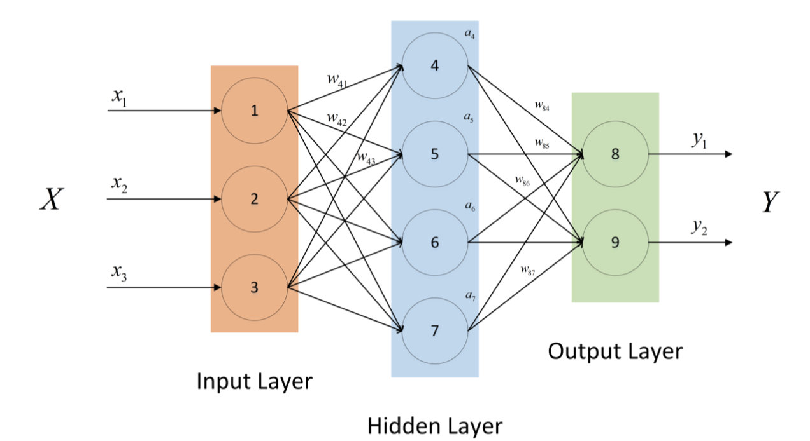

# 1. FP

全连接层是指一层的每个节点都和前一层的所有节点相连。最简单的是两层的全连接层，如下图所示：

首先定义输入：$\boldsymbol X_{N, d_1} ^1$，其中$N$是输入的样本数量，$d_1$是输入特征的维度；$\boldsymbol X_{N, d_2}^2$是指隐藏层的表示，$\boldsymbol Y_{N, d_3}$是指输出层的表示：
$$
\boldsymbol X_{N, d_2}^2=F(\boldsymbol X_{N, d_1} ^1 \boldsymbol W_{d_1, d_2}^1), 
\qquad \boldsymbol Y_{N, d_3}= \boldsymbol X_{N, d_2} ^2 \boldsymbol W_{d_2, d_3}^2
$$
其中$\boldsymbol W_{d_1, d_2}^1, \boldsymbol W_{d_2, d_3}^2$分别为两层的参数，$F$为激活函数。最后计算loss：
$$
loss = lf(Y_{N, d_3}, Y_{label})
$$
前向传播的过程就大致如上图所示。

# 2. BP

在反向传播的时候，我们从$loss$开始，一级一级把梯度反向传播：
$$
\frac {\partial loss}{\partial \boldsymbol W_{d_2, d_3}^2} = 
\frac {\partial \boldsymbol Y_{N, d_3}}{\partial \boldsymbol W_{d_2, d_3}^{2}} \frac {\partial loss}{\partial \boldsymbol Y_{N, d_3}}=
\boldsymbol X_{N, d_2} ^{2T}  \frac {\partial loss}{\partial \boldsymbol Y_{N, d_3}}
\\

\frac {\partial loss}{\partial \boldsymbol W_{d_1, d_2}^1}= \frac {\partial loss}{\partial \boldsymbol Y_{N, d_3}} \frac {\partial \boldsymbol Y_{N, d_3}}{\partial \boldsymbol X_{N, d_2}^2} 
\frac {\partial \boldsymbol X_{N, d_2}^2}{\partial \boldsymbol W_{d_1, d_2}^1}=
\boldsymbol X_{N, d_1} ^{1T}\frac {\partial loss}{\partial \boldsymbol Y_{N, d_3}}\boldsymbol W_{d_2, d_3}^{2T} F^{'}
$$
其实在计算的时候可以存储到每一层的梯度的值，直接利用矩阵相乘计算$loss$关于参数的梯度就可以了。

这里稍微总结一下矩阵求导的法则：

对于神经网络而言，最后的输出$loss$是一个标量，而中间层$l$的的节点则是一个向量或者矩阵，假设通用的公式为：
$$
X^l_{N, d_l}=F(X_{N,d_{l-1}}^{l-1}W_{d_{l-1}, d_l}^{l-1})
$$
则假设我们已经求得：$\frac {\partial loss}{\partial X^l}_{{N, d_l}}$，则：
$$
\frac {\partial loss}{\partial X_{N, d_{l-1}}^{l-1}}=\frac {\partial loss}{\partial X^l}_{{N, d_l}} W^{(l-1)T}_{d_l, d_{l-1}} \\
\frac {\partial loss}{\partial W_{d_{l-1}, d_{l}}^{l-1}}= X^{(l-1)T}_{d_{l-1}, N} \frac {\partial loss}{\partial X^l}_{{N, d_l}}
$$
在全连接层里每一层的节点是向量，在其他网络里，可能是矩阵，操作都是一样的。**这就是适合于神经网络反向传播的标量对矩阵求导的传播**，简单记忆：**求导位置变上一层导数，另外一个位置换成转置**。

# 3. 参数数量

假设前一层有$d_1$个节点，后一个有$d_2$个节点，那么全连接层一共有$d_1 * d_2$个节点。

