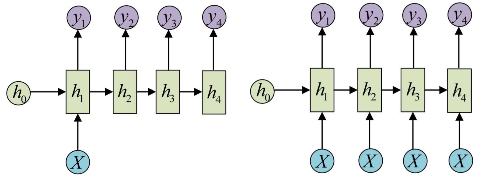
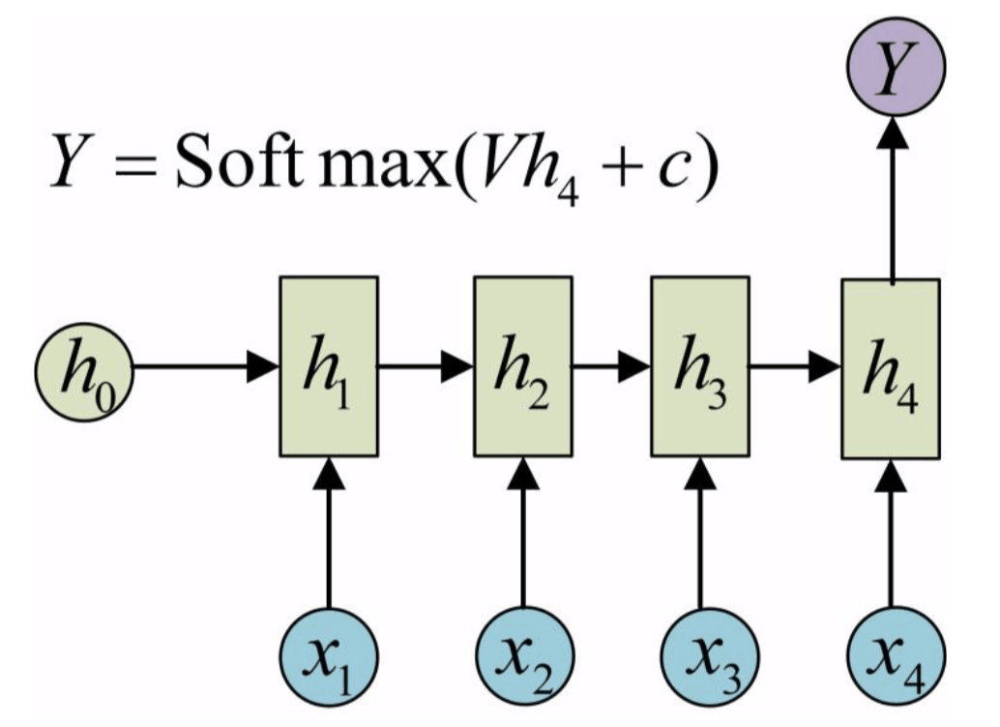
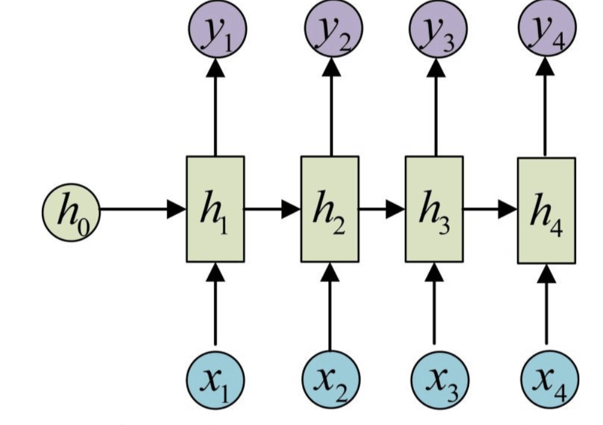
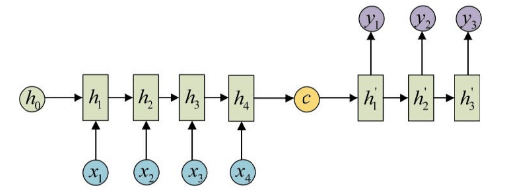
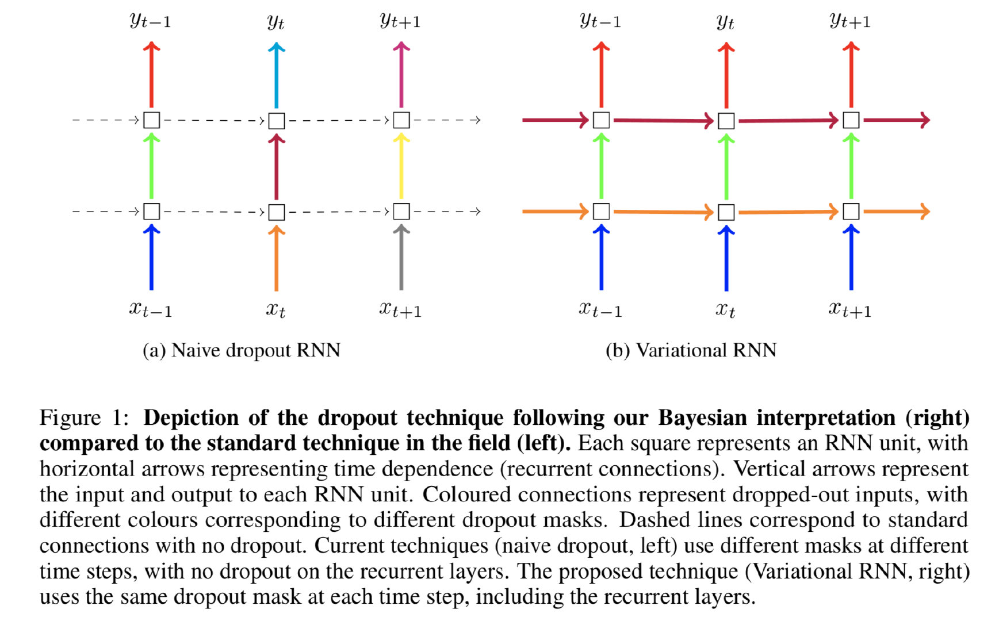

# 1. Simple RNN

## 1.1 基本结构

1. **Vector to Sequence**

   这种一对多结构，是输入一个单元，输出n个单元。主要处理方法有如下两种方式：

   

   一种是每一步都输入，一种是只在第一步输入。

   

2. **Sequence to Vector**

   这种是多对一结构，由一个序列输入得到最终一个输出单元。

   这种是多对一结构，每一步输入一个输入单元。

   

3. **Sequence to Sequence**

这种是最经典的结构，输入一个序列，得到另一个序列。

4. **Encoder-Decoder**

   

这种是先编码序列$X$成向量$c$，然后再解码成序列$Y$，当然$c$也可以在生成$Y$的时候每一步都作为输入。

## 1.2 FP传播

下面以最经典的Sequence2Sequence结构为例，来看一下RNN的数据如何前行传播。首先定义输入$x_{m, d}$，表示输入有$m$个单元，每个单元的向量维度为$d$，$x_t:(1, d)$表示第$t$个输入单元。输出$Y_{m, d}$，为了方便推导，假设输出维度和输入维度相同。同样$y_t(1, d)$表示第$t$个输出单元。第$t$个隐层状态用$h_t(1, d)$表示。

则数据流动可以表示为：
$$
h_t = tanh([h_{(t-1)}; x_t]W + b) \\
Y_i = tanh(h_{t}V + c)
$$
其中$W_{2d, d}, b_{1, d}$为隐藏层的参数。

## 1.3 BP传播

为了简单起见，推导反向传播的时候不考虑$Y$，只考虑参数$W$的梯度。

假设$\hat x_t=[h_{(t-1)};x_t]$：
$$
\frac {\partial h_t}{\partial W}=
tanh^{'}{(t)} \hat x_i + 
tanh^{'}{(t)}tanh^{'}{(t-1)} \hat x_t \hat x_{(t-1)}W +\quad ...\quad +
W^{t}\prod_{j=0}^{t} tanh^{'}{(j)} \hat x_j
$$

* 最重要的是会有参数$W^i$，这样会造成梯度爆炸或者消失，主要是因为共享参数造成的。

* 所有对$W$参数的梯度求和，用到多少输出，就对多少求和。

* 梯度爆炸会导致参数的更新失去意义，参数无限大，一般可以使用梯度裁剪来解决梯度爆炸的问题。
* 梯度消失会使得距离比较远的单元丧失对梯度的影响，就是长距离依赖问题。一般使用带gate的结构如LSTM和GRU解决。

# 2. LSTM

## 2.1 基本概念

$$
\begin{aligned} 
input\ gate: \quad i_{t} &=\sigma\left(W_{i}[x_{t};h_{(t-1)}]+b_{i}\right) 
\\ forget\ gate: \quad f_{t} &=\sigma\left(W_{f} [x_{t};h_{(t-1)}]+b_{f}\right) 
\\ output\ gate: \quad o_{t} &=\sigma\left(W_{o} [x_{t};h_{(t-1)}]+b_{o}\right)
\\ cell\ gate: \quad \widetilde c_{t} &=\tanh \left(W_{g} [x_{t};h_{(t-1)}]+b_{g}\right) \\
 
\\ cell\ state: \quad c_{t} &=f_{t} * c_{(t-1)}+i_{t} * \widetilde c_{t} 
\\ hidden\ state: \quad h_{t} &=o_{t} * \tanh \left(c_{t}\right) \end{aligned}
$$

* 核心是新增了一个cell state: $c_t$，利用$c_t$来更新本次的状态；
* cell gate来计算本次的细胞门；
* forget gate来控制cell state是否遗忘之前的cell state；
* input gate主要来控制是否输入本次的cell gate；
* output gate主要来控制是否输出cell state（输出到hidden state）。

# 3. GRU

## 3.1 基本概念

$$
\begin{aligned}
reset \ gate&: \quad r_{t}=\sigma\left(W_{r} [x_{t};h_{(t-1)}]+b_{r}\right)
\\ update \ gate&: \quad z_{t}=\sigma\left(W_{z} [x_{t};h_{(t-1)}]+b_{z}\right)
\\ hidden \ gate&: \quad \widetilde h_{t}=\tanh \left(W_{n} [x_{t};r_{t} *h_{(t-1)}]\right) 
\\
\\ hidden \ state&: \quad h_{t}=z_{t} * \widetilde h_{t}+(1-z_{t}) * h_{(t-1)}
\end{aligned}
$$

* 核心是hidden state：类似于LSTM的cell state，更新本次状态；
* hidden gate：仅利用本次状态计算hidden gate，类似于LSTM的cell gate；
* reset gate：计算hidden gate时控制是否重置上次的hidden state；
* update gate：更新hidden state时控制是否更新本次状态（hidden gate）；

# 4. 梯度消失问题

## 4.1 GRU与LSTM区别

* GRU只有两个门，LSTM有三个。
* GRU没有cell state，直接计算hidden state。
* GRU中的update gate相当于LSTM中input gate和forget gate的结合。

## 4.2 造成原因及影响

- 一般深层网络中的梯度消失是指浅层网络的梯度过于小，得不到更新。
- RNN中的梯度消失主要是指浅层time step的信息由于共享参数矩阵的连乘，会导致最终浅层数据影响参数梯度的信息消失，即无法解决长距离依赖。
- 解决方法就是LSTM和GRU等带有gate的结构；但这些结构并不能解决梯度爆炸的问题，梯度爆炸可以用简单的梯度裁剪等手段解决。

## 4.3 LSTM和GRU为什么可以解决梯度消失

* 以LSTM为例，在求导时，我们发现：令$\delta _t=\frac {\partial loss}{\partial c_t}$，则$\delta_{(t-1)}=\delta _t \frac{\partial c_t}{\partial c_{(t-1)}}= \delta _t (f_t + …)$，我们会发现，如果控制forget gate激活值在1附近，则连乘也不会导致其梯度消失（即forget gate的值越偏向1，越不会遗忘之前的信息）。

# 5. 其他

## 5.1 Dropout

RNN中的dropout有两种应用形式：

* 传统的Dropout应用形式如左图所示，每一层RNN内部循环是不使用Dropout的。在对每层RNN输入中的每个时间步都使用不同的Dropout掩码。
* 有一种变种是在每层RNN循环内部对隐层状态$h_t$做Dropout，并且同一层的不同时间步的掩码一样。并且同样也在每一层的输入$x_t$上做掩码，每一层使用相同的掩码。
* 详细对比请阅读论文：[A Theoretically Grounded Application of Dropout in Recurrent Neural Networks](https://arxiv.org/abs/1512.05287)。

