# 1. 激活函数

## 1.1 ReLU

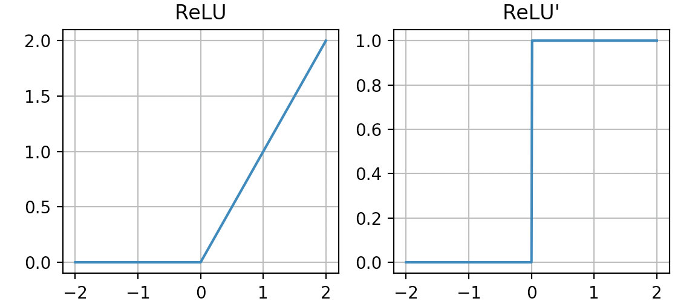

* $ReLU(x) = max(0, x)$；
* 优点：具有稀疏性（0多），训练速度快（梯度大 为1），部分解决了梯度消失的问题。
* 缺点：容易死掉（梯度为0）。

## 1.2 Leaky ReLU

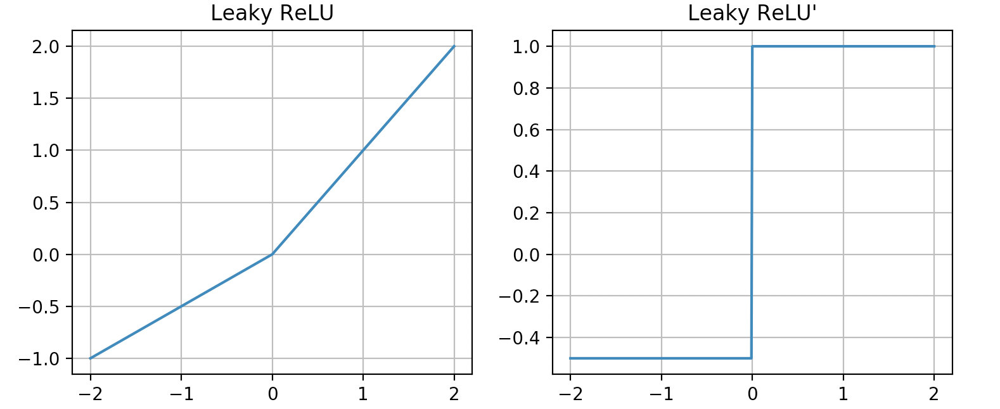

* $Leaky ReLU(x)=\left\{\begin{array}{ll}{x} & {\text { if } x \geq 0} \\ {\frac{x}a} & {\text { if } x<0}\end{array}\right.$
* 针对ReLU易死掉的缺点进行修正。

## 1.3 Sigmoid

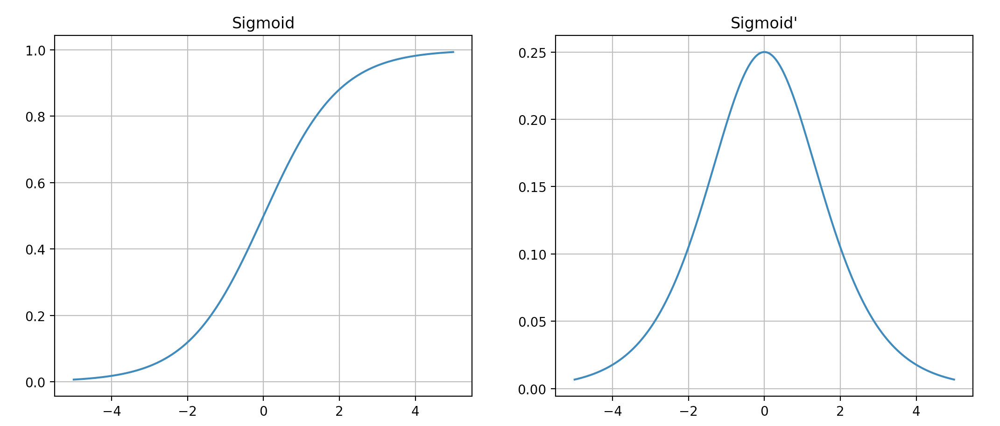

* $Sigmoid(x)=\frac {1}{1 + e^{-x}}$，将输出概率化；
* 计算量比较大（涉及指数运算），比较容易梯度消失（梯度最大为0.25），比较容易饱和（梯度太小）。

## 1.4 tanh

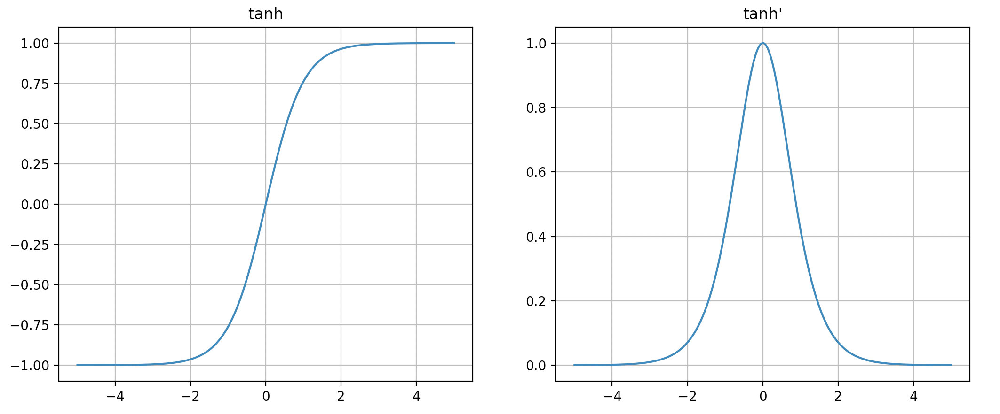

* $tanh(x) = \frac {e^{x} - e^{-x}}{e^{x} + e^{-x}}$；
* 均值为0，梯度比sigmoid更大，所以更新快。
* 比较容易梯度消失。

# 2. 几种Norm的比较

## 2.1 Internal Covariance Shift (ICS)

* ICS的意思是每个神经元的输入数据不再符合独立同分布假设（而这正是机器学习中最重要的假设）。

* why? 深度学习网络每一层的参数更新会导致上层的输入数据分布发生变化，越往后变化越剧烈，所以数据输入分布不再符合独立同分布。
* 影响：
  * 上层参数需要不断适应下层参数的变化，导致上层参数难以学习。
  * 下层输入偏向于变小，导致上层参数进入饱和区，梯度消失，学习过早停止。
  * 各层之间的参数相互影响，参数更新必须更加谨慎。

## 2.2 理想方法

对每一层数据进行白化（去除数据之间的相关性，现进行PCA，然后再进行方差归一化操作），使其独立同分布。但是代价太大，且不可微。因此妥协的方法是进行Norm操作，在每一层对X进行平移和伸缩变换，将X的分布规范化成固定区间的标准分布。通用框架为：
$$
h = f(\gamma \odot \frac{X - \mu}{\delta} + \beta)
$$
$\mu, \delta$是调整$X$到$[0, 1]$，是对数据做归一化，而$\gamma, \beta$为了保证模型的表达能力，保证了模型能学到东西（并且比较容易学习）。这种对$X$的变化都是在激活之前做的。

有一点需要做说明，$\mu, \delta, \gamma, \beta$ 都是以特征为单位做的。而不是简单的理解为神经元，后面会针对具体方法对全连接层、卷积层、RNN做说明。

* 全连接层：输入 $(batch, d)$。
* 卷积层：输入 $(batch, C, H, W)$。
* RNN：输入 $(batch, m, d)$。

## 2.3 Batch Norm

对所有Batch的同一个神经元进行操作，$\mu, \delta$ 为每个神经元的均值和方差（对batch求取）。

* 适用于Batch比较大，且数据分布相近的情况，Batch统计是对整体的估计。
* 不适用于动态网络和RNN，因为每一步都需要保存这种状态。
* 测试时，若输入一条数据，则适用训练时的所有Batch的均值和方差的无偏统计量模拟。
* 为何不用全局统计量？为了保持Batch分布稳定，并且全局统计量与梯度优化存在冲突。

**如何使用**：

* 在全连接层中，一个神经元就是一个特征，所以是对每个神经元的所有Batch数据做平均和方差。也就是对除$d$外的维度求均值和方差，学习到 $d$ 个不同的 $\mu, \delta, \gamma, \beta$。

* 在卷积层中，一个channel才能视为一个特征，所以是对除了$C$以外的其他维度求均值和方差。共学习到 $C$ 个不同的 $\mu, \delta, \gamma, \beta$。

* 在RNN中如何使用BN是一项有待研究的工作，主要应用方式有以下几种，首先先写出RNN的迭代公式：
  $$
  h_{t}=\phi\left(W_{h} h_{t-1}+W_{x} x_{t}\right)
  $$

  1. 第一种明显的方法是：$h_{t}=\phi\left(B N\left(W_{h} h_{t-1}+W_{x} x_{t}\right)\right)$，实验证明这样的结果并不好，也就是说不能在隐藏层节点和输入节点做完加法后进行BN，可能因为两个特征并不同质，相加后做变换效果不好。共维护 $m$个 $\vec {\gamma}, \vec \beta$。（注意：RNN中参数是向量，后两个参数是标量）。
  2. 第二种方法是：$h_{t}=\phi\left(W_{h} h_{t-1}+B N\left(W_{x} x_{t}\right)\right)$，只对输入做BN，但是做完归一化的输入和没做归一化的隐藏节点相加效果也不好，会容易过拟合。共维护 $m$个。$\vec {\gamma}, \vec \beta$
  3. 第三种方法是：$h_{t}=\phi\left(B N\left(W_{h} h_{t-1} ; \gamma_{h}, \beta_{h}\right)+B N\left(W_{x} x_{t} ; \gamma_{x}, \beta_{x}\right)\right)$,分别作BN，然后再相加。而且不同的时间步，保留自己不同的参数，而不是类似于RNN的参数共享。另外，$\gamma$ 的初始值要小一些。对每一步的所有batch数据计算均值和方差，共维护 $2m$个 $\vec \gamma, \vec \beta$。
  4. 以上三种都是对水平方向上做BN，第四种就是对竖直方向上的RNN层之间做BN，竖直方向上使用BN需要层数比较深。共维护 $m * l$个 $\vec \gamma, \vec \beta$。
  5. RNN中应用BN效果并不好。

## 2.4 Layer Norm

对单个输入的所有神经元操作。

* 不依赖于Batch的大小，不依赖于其他数据，只依赖本次输入的数据。
* 可用于RNN和动态网络。
* 适用于不同输入特征属于相似的类别情况，否则会降低模型的表达能力。

**如何使用**：

* 全连接层：为每一个输入数据维护一个参数，也就是一个batch会有 $batch$ 个 $\mu, \delta, \gamma, \beta$。
* CNN：对除 $batch$ 外的所有维度求均值和方差，也就是一个batch会有 $batch$ 个 $\mu, \delta, \gamma, \beta$。
* RNN：$h_{t}=\phi\left(L N\left(W_{h} h_{t-1}+W_{x} x_{t}\right)\right)$，对每一步的输入的数据做均值和方差，也就是只依赖于当前时间点的数据，在每一步共享参数$\vec \gamma, \vec \beta$，所以共维护 $batch$个 $\vec \gamma, \vec \beta$。

## 2.5 Weight Norm

$$
h = f(\frac {x}{||w||})=\frac{wx}{||w||}
$$

* 通过参数的模对输入进行规范化。
* 避免了对Batch的依赖。

## 2.6 Cosine Norm

$$
h = \frac{wx}{||w||*||x||}
$$

* 可能导致表达能力下降。

## 2.7 总体作用

* 加速网络的收敛（解决深层数据变化较大的问题）
* 加速网络的训练（使得梯度保持在合理范围，不会过小）。
* 防止过拟合（输入的微小扰动不会造成结果的巨大变化）。
* 防止梯度消失（通过控制激活值的大小在合理范围）。
* 可以使用较大的学习速率（普通网络因为多层叠加会使得学习速率（梯度）爆炸或者消失，而现在可以使用较大的学习速率，因为每一层的作用不会叠加）。
* 减小初始值的影响（BN直接对激活值进行调整，不需要初始化合理参数来保持激活值在合理范围）。

# 3. 如何解决过拟合

## 3.1 数据方面

### 3.1.1 获得更多的数据

* 使得样本数据分布更能逼近真实的数据分布。这样，模型学到的分布就比较偏向了真实数据分布了。

* 这样，模型的训练误差就比较接近泛化误差了。

* 一般获得更多数据的方法有：

  * 从数据源头收集更多数据。
  * 复制原有数据，并在数据上添加噪声，生成新数据。
  * 重采样。
  * 根据当前数据估计数据分布参数，利用该分布参数产生更多数据。

  

## 3.2 模型方面

选择合适的模型，减小模型层数、神经元个数可以限制模型的拟合能力，从而防止过拟合。

### 3.2.1 L1 L2正则化

* L1正则化可以产生稀疏权值矩阵，同时在一定程度上可以防止过拟合。L2正则化主要是防止过拟合。
* 二者都偏好参数绝对值小的参数，**这样的模型比较简单、可以抵抗噪声，并且泛化能力强**[输入的微小扰动并不会是使输出发生巨大变化]。
* L1适用于特征之间有关联的情况，L2适合特征之间没有关联的情况。

### 3.2.2 Dropout

* Dropout其实是一种集成学习方法，每次都会产生不同的子网络。
* 训练时要对每个单元状态乘以$\frac {1}{1-p}$，以保证每个单元的输出期望不变，或者测试时乘以$p$。
* Dropout中的各个模型并不独立，他们共享参数。

**Dropout 为什么可以防止过拟合**：

* 首先Dropout由于忽略了部分节点，可以使网络变得简单，越简单的网络越不容易过拟合。
* Dropout类似于集成学习，每次训练相当于一个基学习器，最后汇总所有基学习器的结果。这样可以减少泛化误差。
* Dropout相当于减少了模型对单个或特定神经元组合的依赖，也就是对特定特征才有效的依赖（因为这些节点并不一定同时出现）。这样，就可以迫使模型去学习更具有鲁棒性的特征，从而防止过拟合，增强泛化能力。
* 另外，Dropout后给数据增加了噪声，相当于增强了数据，增加了样本。（可以在输入层接一个p接近1的Dropout，以一个较小的概率丢弃输入，相当于给输入数据增加了噪声）。

### 3.2.3 集成学习

* 集成学习器相当于集合了多个基学习器的优点。
* 从统计的角度看，一般认为学习任务的假设空间是很大的。单一数据集学到的分布可能只是一部分表达，利用多个学习器学得不同的表达，可以更好的逼近数据分布假设空间。
* 从计算的角度看，单次训练可能会陷入局部极小值点，对泛化误差影响较大。多个学习器就可以避免这种情况。
* 从表示的角度看，学习任务的假设空间可能并不在当前模型的假设空间里，那么多个学习器可以扩展当前的假设空间。

## 3.3 其他

* 提前停止，在验证准确率不再提升的情况下，停止模型学习更加深入的特征。
* 给数据增加噪声。
* 数据清洗。
* BN，限制了梯度的波动，一定程度上限制了参数的波动，降低了参数的搜索空间，因此增强了泛化能力。（BN最主要的作用是加速模型的训练，只是有缓解过拟合的作用（存疑））。

# 4. 参数初始化

## 4.0 Why

* 为了让网络在训练过程中学习到有用的信息，这意味着梯度不能为0。
* 而参数梯度与状态梯度、入激活值有关。意味着状态梯度不能太小，入激活值不能太小（0）也不能饱和。
* 所以会希望各层数据均值为0，方差不变。
* 为了使数据在经过多层网络后，不被过分放大或者缩小，希望保持每个神经元的输入输出方差一致。

## 4.1 随机初始化

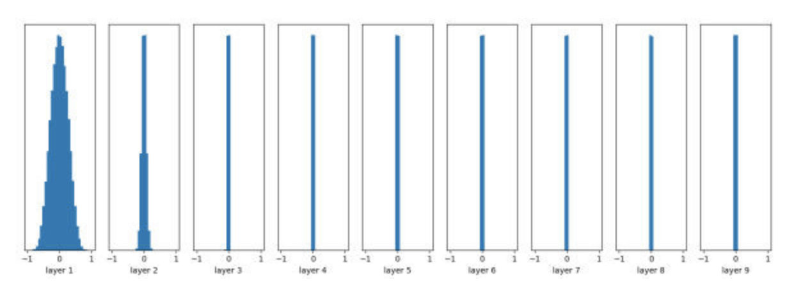

* 不管输入数据如何，层数越深，数据都会疯狂向0(或者+-1)靠拢（取决于标准差的大小），导致参数梯度为0。
* 随机初始化主要的问题是数据的方差会被放大。

## 4.2 标准初始化

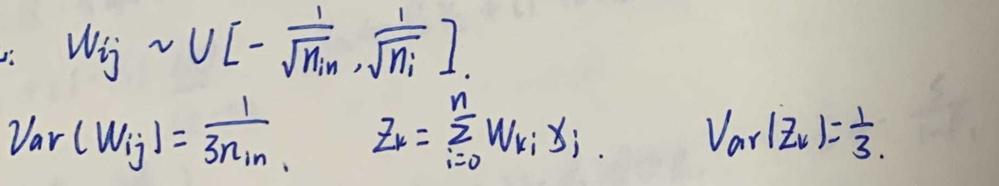

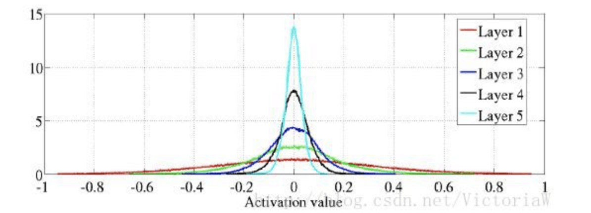

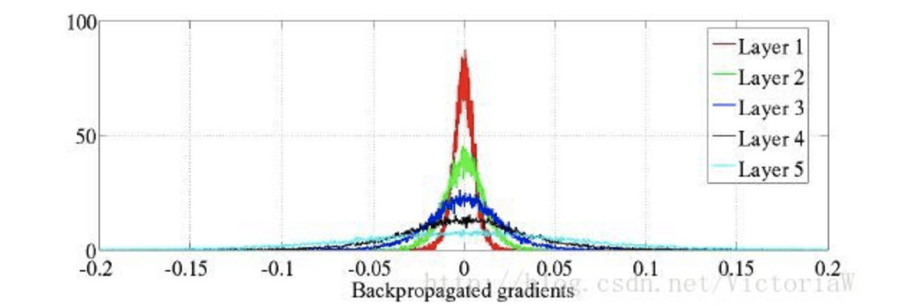

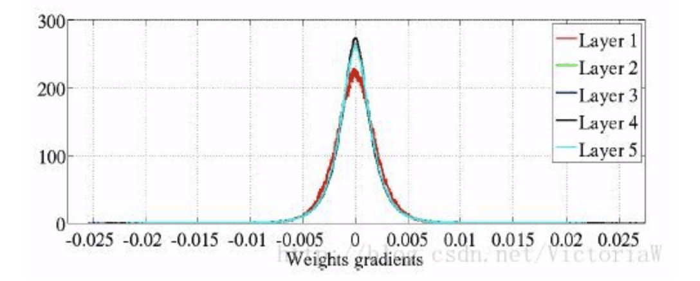

* 这样，第一层状态值的均值为0，方差为常量$\frac {1}{3}$。因此Sigmoid不符合条件（输出均值不为0）。
* 层数越深，激活值方差越小（数据越集中到0），状态梯度就越小，参数梯度方差不变（但是期望变小了）。

## 4.3 Xavier初始化

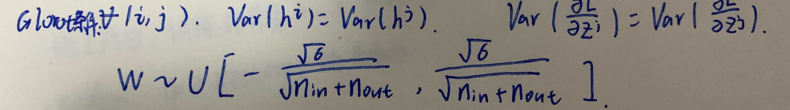

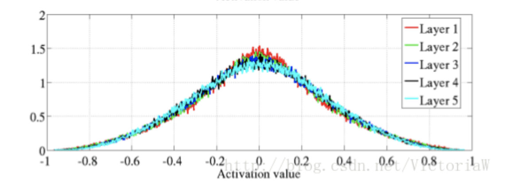

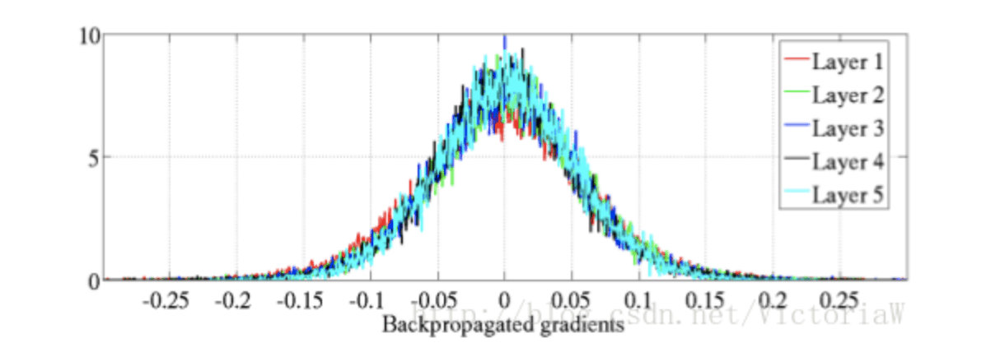

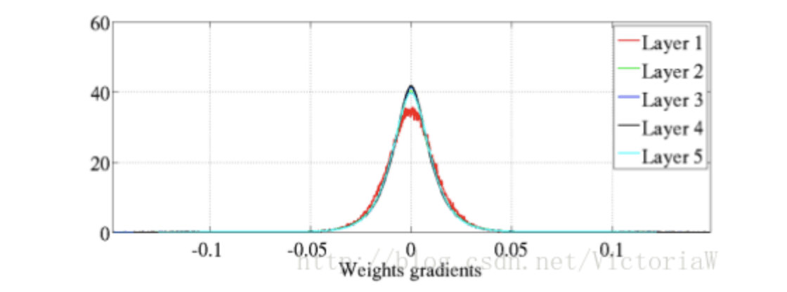

* 保持各层激活值方差保持一致，各层状态梯度方差也保持不变（参数梯度方差也保持不变）。
* 基于假设：初始时，激活函数落在线性区域（因为推导基于线性函数）、激活函数0对称。
* 所以仅对tanh激活函数有效。

## 4.4 He初始化

考虑ReLU非线性映射的影响，输出期望不为0，因此调整方差规范系数即可，将非线性映射的影响考虑进参数初始化中。因此，He初始化适用于ReLU激活函数。

原理和Xavier一样，是保持输入和输出数据的方差保持不变。

# 5. 参数优化方法

## 5.0 SGD(Mini-Batch)

* 梯度下降为每个参数指明了各自能使损失函数下降最快的方向，但是并不能保证累计结果也是最优。

* 为什么批训练（梯度准确性、梯度方差、泛化误差、学习时间、矩阵运算优化等）：
  * 随机梯度下降法，每次使用一个数据。梯度方差大，精度低；学习速度快、泛化误差小（由于噪声的引入）。由于方差较大，因此需要较小的学习速率。
  * 全梯度下降法，每次使用所有数据。梯度方差小、精度高；学习速度慢，泛化误差大、更新慢（由于每次更新计算量太大）。有几率会跳出现在的局部极小值点，从而进入全局最小值点。
  * 批梯度下降法综合了二者的优点。
* 缺点：
  * 由于每个梯度更新速率相同，因此比较难选择合适的学习速率，容易收敛到局部最优。
  * 目前采取的方法一般是随着训练的进行根据某种规则降低学习率。
  * 还容易进入马鞍面，此时一部分点上升、一部分点下降，效果抵消，梯度为0。

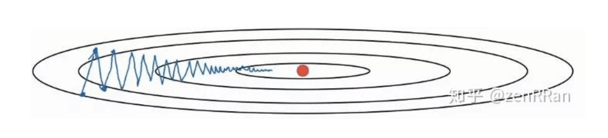

## 5.1 Momentum动量算法

$$
v \leftarrow \alpha v+\epsilon g, \qquad \theta \leftarrow \theta-v
$$

* 解决SGD梯度更新只依赖当前Batch的缺点。
* 需要累积历史梯度，模拟物体运动的惯性，减少优化过程中的徘徊，可以增加稳定性。
* 若梯度方向不变，则会一直学习速度增大，增大到原来的$\frac {1}{1-\alpha}$倍。

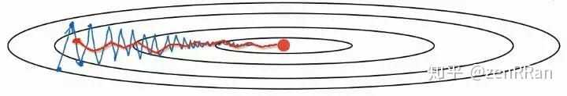

## 5.2 AdaGrad算法

$$
r \leftarrow r+g \odot g, \qquad \Delta \theta \leftarrow-\frac{\epsilon}{\delta+\sqrt{r}} \odot g, \qquad \theta \leftarrow \theta+\Delta \theta
$$

* 每个梯度学习速率不同。对每个梯度累积历史梯度，历史梯度越大，现在更新速率的衰减就越大，更新幅度就越小。因此在参数空间平缓的区域（历史累计梯度小）会取得更大的进步。并且能使陡峭的方向（历史累计梯度大）变得平缓（速率衰减快）。
* 可以认为是对出现频率较高（历史梯度较高）的参数降低更新速率，出现频率低的参数增加其学习速率（相对）。
* 因为分母上梯度的累加会越来越大，所以缺点是学习速率提前衰减过快。

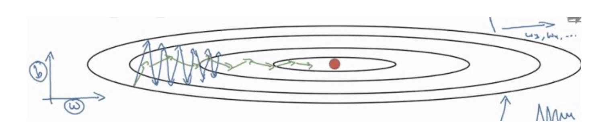

## 5.3 RMSProp

$$
r \leftarrow \alpha r+(1-\alpha)g \odot g, \qquad \Delta \theta \leftarrow-\frac{\epsilon}{\delta+\sqrt{r}} \odot g, \qquad \theta \leftarrow \theta+\Delta \theta
$$

* 对历史梯度进行移动指数加权平均，而不是简单求和。是对AdaGrad的一个改进。
* 缓解了AdaGrad学习速率下降过快的问题。

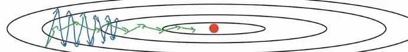、

## 5.4 Adam

$$
{m_{t}=\beta_{1} m_{t-1}+\left(1-\beta_{1}\right) g_{t}}, \qquad {v_{t}=\beta_{2} v_{t-1}+\left(1-\beta_{2}\right) g_{t}^{2}} \\
{\hat{m}_{t}=\frac{m_{t}}{1-\beta_{1}}} \qquad {\hat{v}_{t}=\frac{v_{t}}{1-\beta_{2}}} \\
\theta_{t+1}=\theta_{t}-\frac{\eta}{\sqrt{\hat{v}_{t}}+\epsilon} \hat{m}_{t}
$$

* Adam集合了Momentum和AdaGrad两种方法。
* 修正原因：训练初期$\beta_1, \beta_2$的存在导致$m_t, v_t$太小。

## 5.5 Nesterov

以叠加Momentum为例：

Momentum原本的更新策略是先计算出梯度（根据未更新的参数），然后更新动量，然后更新参数：
$$
\begin{aligned} d_{i} &=\beta d_{i-1}+g\left(\theta_{i-1}\right) \\ \theta_{i} &=\theta_{i-1}-\alpha d_{i} \end{aligned}
$$
在计算梯度时，用的是上一步还未更新过的参数，本来SGD不存在这种问题，但是Momentum引入了动量（其他优化算法也引入了之前的梯度信息）。

这样，本次参数更新依赖两部分，一部分是历史梯度信息，$\beta d_{i-1}$是确定的。而另一部分则是本次的梯度信息，$g\left(\theta_{i-1}\right)$是不确定的。既然更新有很大程度时确定的，为什么不在这次计算梯度的时候就利用这个确定的信息呢？这就是Nesterov的思想，计算梯度时提前部分更新参数，利用这个部分更新的参数来计算梯度。
$$
\begin{aligned} d_{i} &=\beta d_{i-1}+g\left(\theta_{i-1}-\alpha \beta d_{i-1}\right) \\ \theta_{i} &=\theta_{i-1}-\alpha d_{i} \end{aligned}
$$

* 抽象来说，是相当于让梯度更快的看到了前方的情景，直接依据前方的情景更新参数，加速了训练过程。
* 经过化简后可以得出，其实先部分更新参数，其实相当于多出了上两步梯度的变化信息，就是参数的二阶导数信息。相当于利用二次导数信息加速了参数更新的幅度。

$$
\begin{aligned} d_{i} &=\beta d_{i-1}+g\left(\theta_{i-1}\right)+\beta\left[g\left(\theta_{i-1}\right)-g\left(\theta_{i-2}\right)\right] \\ \theta_{i} &=\theta_{i-1}-\alpha d_{i} \end{aligned}
$$

## 5.6 牛顿法

梯度下降法是沿着一阶导数下降最快的方向寻找极小值点，而牛顿法是用二阶的海森矩阵的逆矩阵求解。
$$
梯度下降法：x^{(k+1)}=x^{(k)}-\lambda \nabla f\left(x^{k}\right)\\
牛顿法：x^{(k+1)}=x^{(k)}-\lambda\left(H^{(k)}\right)^{-1} \nabla f\left(x^{k}\right)
$$
牛顿法不止考虑梯度最大方向，还进一步考虑更新之后梯度是不是会变得更大。

逆牛顿法是近似求解海森矩阵的逆。加快速度。

# O. 其他问题

## O.1 为什么会发生梯度消失/爆炸？

$$
a_{i+1} = w_ih_{i}, \qquad h_{i+1}=f(a_{i+1}) \\
\frac {\partial loss}{\partial h_i}=\frac {\partial loss}{\partial h_{i+1}}f^{'}w_i
, \qquad \frac {\partial loss}{\partial w_i}=
\frac{\partial loss}{\partial h_{i+1}}f^{'}h_{i}
$$

* 梯度消失/爆炸本质上都是由于反向传播造成的。
* 反向传播时，关于参数的梯度会出现**各层三项相乘：激活函数导数、激活值、参数值**。
* 因此，梯度爆炸/消失都是由于各项连续大于一或小于一造成的。
* 激活函数：Sigmoid、Tanh激活函数的导数最大值都小于一（0.25和0.5），多层连乘，会很容易梯度消失（$0.25 ^4=0.0039$）。由于激活函数的梯度爆炸一般不会出现，因为梯度最大的激活函数ReLU也才是1。
* 激活值：每一层单元的激活值如果比较大，就会出现梯度爆炸，比较小就会出现梯度消失。
* 梯度值：每一层梯度值如果过小的话，连乘会导致梯度更新为0。

## O.2 如何解决梯度消失/爆炸？

* 梯度本身（梯度爆炸）：
  * 梯度修剪，剪除过大的梯度。
* 参数值（梯度爆炸）：
  * 正则化，正则化也是对过大的梯度进行修剪。
  * 初始化，初始化使得参数值可以在合理范围
* 激活函数（梯度消失）：
  * ReLU就是修正过后的激活函数，正值导数为1，不会梯度消失。
* 激活值（梯度消失/爆炸）：
  * BatchNorm：通过把每一层的激活值伸缩到合理范围，使得梯度可以在合理范围（影响激活值和激活函数）。
* 改变网络结构（梯度消失）：
  * ResNet：直接改变结构，使得梯度可以部分无损传播到前面的层。

1.3 什么是超参数

1.4 如何选择超参数

1.5 交叉熵作为损失函数的好处

* 非负且可导。
* 最大化输出标签的概率。
* 导数不包含激活函数的导数$\frac{\partial C}{\partial w_{j}}=\frac{1}{n} \sum_i x_{ij}(\zeta(z_i)-y_i)$，使得训练速率比较快。