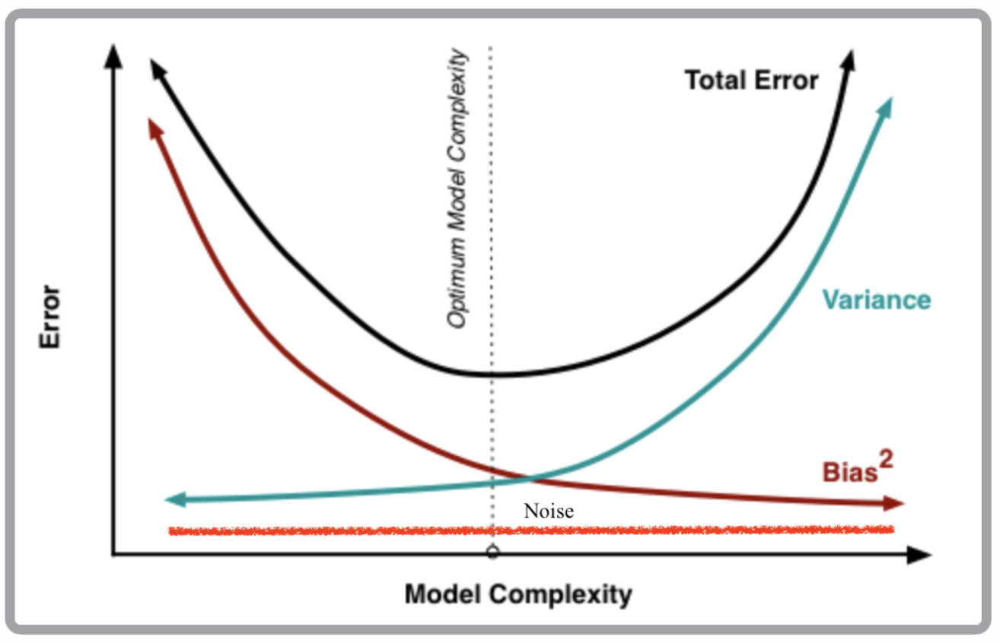
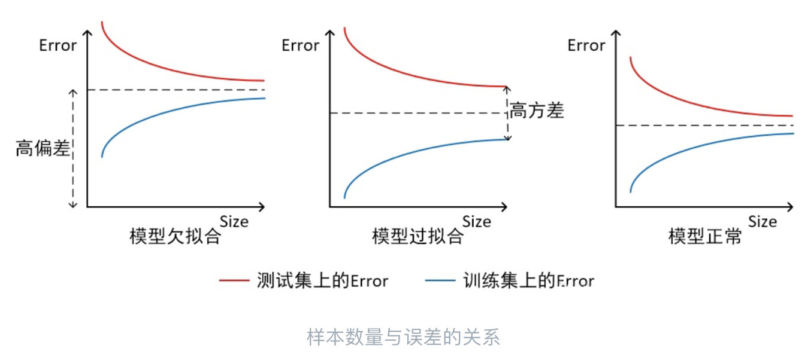
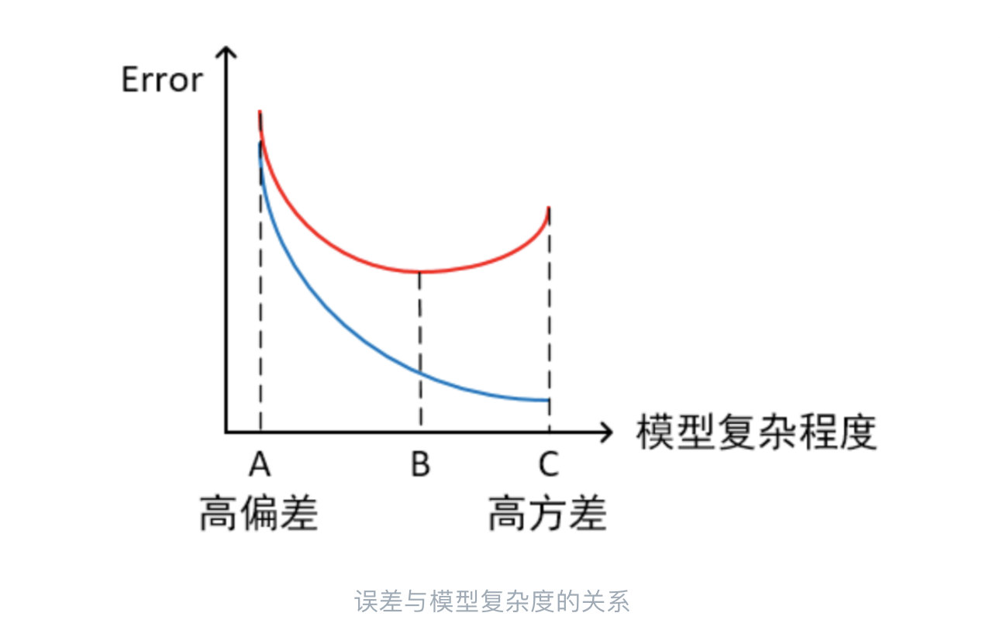
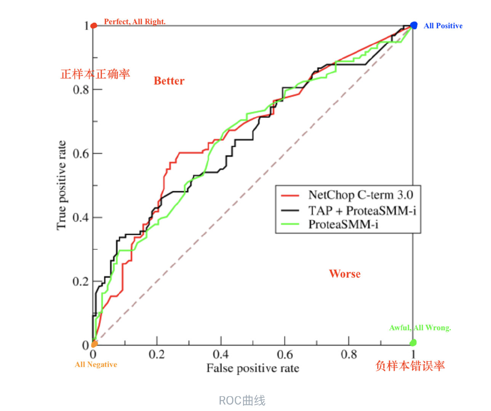
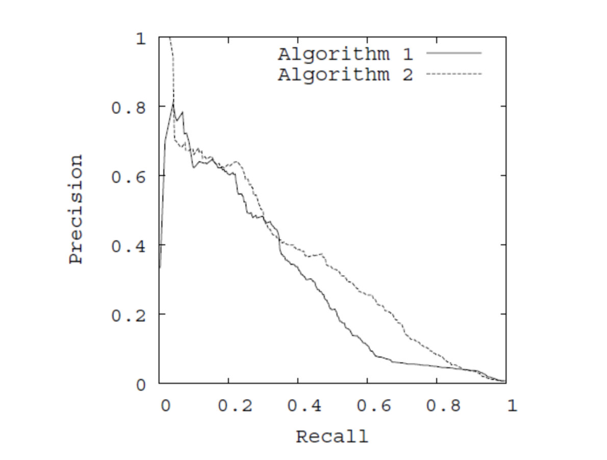

# 1. 误差、偏差、噪声和方差

## 1.1 定义

### 误差（Error）：

- 一般地，我们把机器学习模型的预测输出和样本的真实输出之间的差异称为误差。
- Error反映的是整个模型的准确度，相当于泛化误差。
- 但是真实的泛化误差我们是不能得到的，因为测试集是不存在的。一般只能用验证集代替。
- 一般来说$E\left[(y-\hat{f})^{2}\right]=\sigma^{2}+\operatorname{Var}[\hat{f}]+(\operatorname{Bias}[\hat{f}])^{2}$，$y$是真实标签（不是样本标签）， $\hat f$是模型拟合的函数， $\sigma^{2}$是噪声的方差。
- $Error=Noise+Variance+Bias$。

### 偏差（Bias）：

- 偏差指的是模型在训练集的误差。
- 衡量的是模型拟合训练数据的能力。
- Bias是 “用**所有可能的**训练数据集训练出的**所有模型**的输出的**平均值**” 与 “真实模型”的输出值之间的差异。

### 方差（Variance）：

- 方差描述的是预测值的变化范围，方差越大，数据的分布越分散，模型的稳定性越差。
- 一般来说，如果模型在训练集上效果不错，但是在测试集上效果比较差，就是方差较大，模型的对同类型（训练集和测试集）的数据输出波动较大。
- Variance是“**不同的训练数据集**训练出的模型”的输出值**之间**的差异，刻画了数据扰动对模型的影响。

### 噪声（Noise）：

- 噪声指的是数据集中的标签与实际标签的误差。
- 反映的是数据集本身的问题，一般是确定了误差的下限。
- 可以认为是刻画了问题本身的难度。

## 1.2 组成分析

- 在模型训练初期，处于偏差较大，方差较小的阶段。为什么会这样呢？这是因为模型基本还没学到什么东西，对训练集和测试集基本是一视同仁的，不同的训练集训练出来的效果相差比较小，所以方差会比较小。而因为没学到什么东西，在训练集上处于预测和实际差别比较大的阶段。
- 随着训练的进行，模型逐渐学习到了训练集的特征，所以偏差一直在减小。但是为什么方差反而增大了，这是因为模型是在拟合训练集的分布，而训练集并不是真实分布。所以对于不同的训练集训练出来的不同模型，预测输出差别会比较大，也就是方差会增大。
- 在训练的最后阶段，因为模型过多的拟合了训练集的特征，如果换用另外的训练集，得到的模型输出会差别更大，因此方差越来越大。
- 噪声因为是数据本身的问题，所以一直是不变的。
- 但是，如果我们假设训练集就是任务的数据真实分布（理想，不存在），那么其实是没有方差和噪声的，只需要追求偏差最小就好了。

## 1.3 训练的目的

- 训练的目的是为了让测试集上的Error小，也就是泛化误差小。但其实我们是假设不知道测试集的，我们能测试的测试集只是对泛化误差的一个粗略的估计。能知道的只有训练集的误差。
- 所以一方面，我们希望Error(train)能更小，也就是偏差更小；一方面我们也希望Error(train)能更接近Error(test)，也就是方差更小。但是这两个目标是相背离的，前者希望模型更复杂，更好地拟合训练数据；后者希望模型更简单，可以无差别的对待训练集和测试集，也就是无差别的对待局部数据。

## 1.4 如何计算

- 首先我们先看模型，我们选定一个神经网络的结构和超参数，就可以确定整个模型了。
- 那么如何衡量这个模型误差呢？需要对特定模型（同样的结构和超参数）在同样的条件下（选取相同大小但不同的样本作为训练集）重复多次训练，会得到多个具体模型，这多个具体模型可以产生多个预测值。
- 根据样本和这些预测值计算出方差和偏差，就可以帮助我们考察该特定模型的预测误差的期望值，也就能衡量该特定模型的性能。

## 1.5 交叉验证

### 什么是k折交叉验证

把整体数据分为k份，分别作k次实验，每次留出一份作为测试集，用于估计泛化误差，其余作为训练集。模型的泛化误差可以认为是每个模型的泛化误差的估计。那么我们怎么得到最终的模型呢？其实最终模型是采用相同的结构和超参数，使用所有数据再进行一次训练，得到最终模型（这种模型的泛化误差可以认为是之前估计的泛化误差）。

k折交叉验证是计误差的一个折衷，标准的计算方式需要太多的样本。k折交叉验证的k个模型其实是有关联的，因为有很多训练样本是公用的，但可以用作估计。对这k个模型的预测结果进行分析，就可以得到模型泛化误差（偏差以及方差）的估计。

### 满足条件

- 训练集占比要足够多，一般要超过一半，即$k \ge 2$。
- 训练集和测试集要均匀抽样。

### 只分训练集和测试集的缺点

- 模型参数过分依赖训练集和测试集的划分。
- 模型只用到了部分样本进行训练，所以效果会受一定影响。

### 留一法优缺点

- 训练代价太大。
- 完全利用了数据，模型不受数据集划分的影响。保证了模型的Bias更小。

### k大小的选取

- k越大，意味着每次训练集越大，因此模型的Bias越小，但是各个训练集相关性较大，导致最终的误差会有较大的Variance。
- k越小，则刚好反过来，有较大的Bias和较小的Variance。

### 作用

- 更精确的评估模型（相同结构和超参数）的性能。

# 2. 过拟合与欠拟合

## 2.1 定义

过拟合（over-fitting）：过拟合是指模型过多拟合训练样本的特征，而在测试集上不能很好的拟合。一般来说，训练集与测试集上的准确率相差越大，可以认为过拟合程度越大。

欠拟合（under-fitting）：欠拟合是指模型还没有很好地拟合训练集样本的特征（此处指泛化特征），所以训练集和测试集上的准确率都比较低，但此时二者相差一般比较小。

一般来说，随着训练集样本数量的增加，训练集的样本空间会越接近实际样本空间，因此训练集上的特征会更接近泛化特征。

欠拟合情况就是，随着样本数量的增加，训练集和测试集上的误差虽然在接近，但是二者都很高，说明模型并没有学习到训练集上所具有的特征。

过拟合情况就是，随着样本数量的增加，虽然误差较低，但是训练集和测试集上的误差相差较大，说明模型更多的学到了训练集的独有特征，因此在测试集上表现较差。

正常的模型应该随着样本数量的增加，训练集和测试集上的误差会趋近于一样，并且较小。

此处需要解释一下，为什么随着样本数量的增加，训练集误差反而是在增加的呢？这是因为训练集样本数量越多，特征空间就会越复杂，因此模型学习到训练集特征空间的难度就会越难，因此误差是在增加的。但是因为训练集样本空间更接近于实际样本空间，因此测试集误差是在下降的。

## 2.2 误差与模型的关系

一般来说，模型复杂度越高，模型的学习能力会越强，因此训练集误差会不断降低。但是因为模型复杂度越高，越能学习到训练集上的一些非泛化特征，所以会导致测试集样本上的误差反而是在增加的。因此，在模型复杂度低的时候，模型一般是高偏差、低方差、欠拟合的；在模型复杂度过高的时候，模型一般是低偏差、高方差、过拟合的。一般B点是最优的。

## 2.3 如何解决

### 如何解决欠拟合

- 增加模型的复杂度，来增加模型的拟合能力。

### 如何解决过拟合

- 减少模型复杂程度。
  - Dropout，正则化。
  - 改变模型结构。
- 增加样本数量，或者重新清洗数据，增加噪声数据。
- 提前停止，减少迭代次数，增大学习率。
- 集成学习，其实dropout也是这个思想。

# 3. ROC与AUC

## 3.1 混淆矩阵

| 真实/预测 | $P$/ 1 | $N$/ 0 |
| --------- | ------ | ------ |
| $P′$/ 1   | TP     | FN     |
| $N′$/ 0   | FP     | TN     |

$P′$表示真实标签为1的总数。

$N′$：表示真实标签为0的总数。

$P$： 表示预测标签为1的总数。

$N$： 表示预测标签为0的总数。

TP：预测为1，真实为1，预测准确。

FN：预测为0，真实为1，预测错误。

FP：预测为1，真实为0，预测错误。

TN：预测为0，真实为0，预测准确。
$$
P^{'}=TP+FN \qquad N^{'}=TN+FP \qquad P=TP+FP \qquad N=TN+FN
$$

## 3.2 各种基本指标

**准确率（Accuracy）**：分类正确的样本比例，$Accuracy=\frac {TP+TN}{P+N}$。

**错误率（Error）**：分类错误的样本比例，$Error=\frac {FP+FN}{P+N}$。

- 缺点：上述两个对于类别不平衡情况，且关注小类别时基本无用。

**查准率（Precision）**：预测为正的准确率，$Precision=\frac {TP}{P}=\frac {TP}{TP+FP}$。

**查全率（Recall）**：正样本预测准确的比例，$Recall=\frac {TP}{P^{'}}=\frac{TP}{TP+FN}$。

**F1 Score**：$F1=\frac {1}{\frac{1}{2}(\frac 1P + \frac 1 R)}, \qquad F_\beta=\frac1{\frac1{1+\beta^2}(\frac 1P+\beta^2\frac 1R)}$， $\beta$越大，Recall影响越大。

## 3.3 ROC与AUC

ROC（Receiver Operating Characteristic）：是一个衡量分类性能的曲线。

**横轴（x）**：负样本的错误率， $FPR=\frac {FP}{N^{'}}$。

**纵轴（y）**：正样本的正确率，$TPR=\frac {TP}{P^{'}}$。

在曲线的左下方，所有的样本都预测为负，负样本都预测对了，错误率为0，正样本都预测错了，正确率为0；在曲线右上方，所有的样本都预测为正，负样本都预测错了，错误率为1，正样本都预测对了，正确率为1。

曲线上的点以虚线为分界线，越偏向左上方，表示效果越好，因为对x轴来说，负样本错误率越低，对y轴来说，正样本正确率越高。

**AUC（Area Under Curve）**：ROC曲线下方的面积，越大，表示曲线上的点越偏向左上方，性能越好。

### 如何画ROC曲线

确定一个模型，就可以确定每个样本为正例的概率，由高到低排列。阈值由高到低取，依次将每一个样本划分为正例，x轴坐标，分子数上方为N的样本数量即可，y轴坐标，分子数上方为P的样本数量即可，可以画出 $AllSample+1$个点，组成AUC曲线。

### 优点

不管正负样本的比例如何变化，AUC都能很好地衡量模型的性能，不受样本正负样本的分布影响。反观，其他指标都是会受这个影响的。

正例完全排在负例之前会得到AUC面积为1。反之，AUC面积为0。AUC表示的是正样本排在负样本之前的概率。

### 缺点

由于ROC曲线适合比较不同分类器的性能，不随着类别分布变化而变化。导致如果正例有很多，那么正例的准确性变化反映到ROC曲线上就很微弱。导致对同一个模型来说，准确率比较难直观的看出来。

### 适用范围

所以ROC兼顾正例与负例的性能，适合评估模型整体性能。

适合于评估类别分布不同的模型之间的性能比较。

## 2.4 PR曲线

PR曲线和ROC曲线十分相似：

**横轴（x）**：查全率Recall，正样本的准确率，其实就是TPR。

**纵轴（y）**：Precision，预测为正例里预测正确的。

所以PR曲线衡量了R和P的关系变化，绘制方法和ROC曲线类似，同样地，AUC越大，性能越好。PR曲线聚焦于正例的性能。

### 适用范围

适合于评估相同类别分布下的正例的准确率情况。

## 2.5 类别不平衡

类别不平衡问题一般有以下几种解决方法：

- 多收集数据，增加小样本数据数量。
- 对小类别进行过采样。
  - 可以对小样本数据利用插值等方法来产生一些新的小类别样本。
  - 对小类别样本的结果增加权重，在训练的时候可以更加关注小样本。
  - 过采样比较容易导致过拟合，因为新的小样本其实更多是相关的。 
- 多大类别样本进行欠采样。
  - 一般也会同时利用集成学习方法来充分利用大类别的样本。
  - 一般地欠采样会浪费大类别样本的信息。
- 使用新的评价指标。
  - 寻找更适合评价指标。
- 调整阈值。

# 参考资料

1. [偏差Bias和方差Variance——机器学习中的模型选择](https://zhuanlan.zhihu.com/p/44872686)
2. [Cross-Validation（交叉验证）详解](https://zhuanlan.zhihu.com/p/24825503)