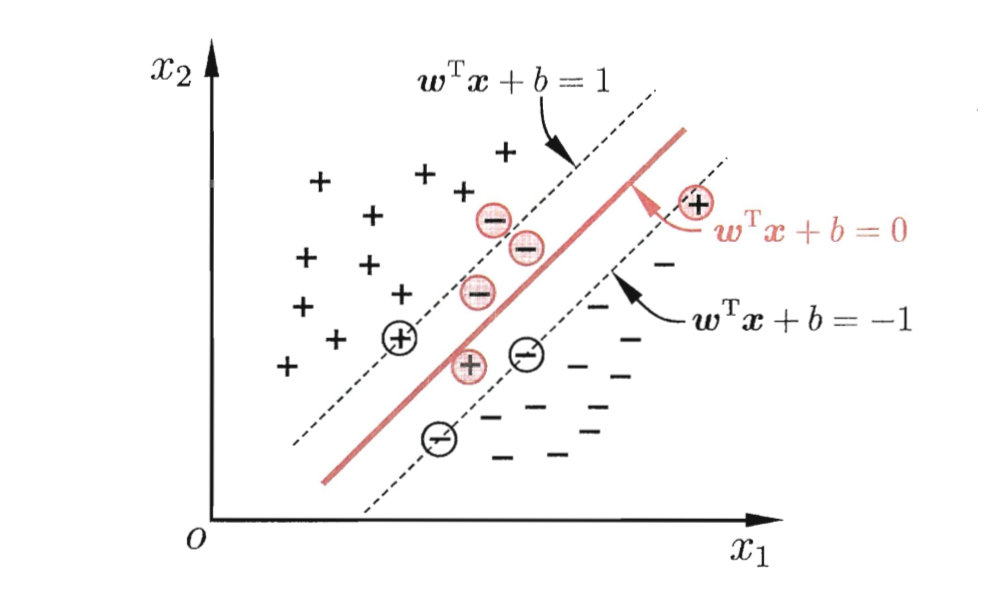

# 1. 定义

支持向量机是一个二分类模型，它在样本空间内定义了一个超平面，将样本空间划分为两部分。目标是使距离超平面最近的样本点的距离最大。

支持向量机主要包括：

* 当训练样本线性可分时，通过硬边界（hard margin）最大化，学习一个线性可分支持向量机；
* 当训练样本近似线性可分时，通过软边界（soft margin）最大化，学习一个线性支持向量机；
* 当训练样本线性不可分时，通过核技巧和软边界最大化，学习一个非线性支持向量机；

# 2. 硬边界

## 2.1 基本模型

我们首先定义数据集$\{(\boldsymbol x_1, y_1), (\boldsymbol x_2, y_2), …, (\boldsymbol x_m, y_m) \}$ ，其中$\boldsymbol x_i=[x_{i1}, x_{i2}, …, x_{id}]^T, y_i=\{ +1, -1\}$，我们需要找到一个超平面来划分样本空间：
$$
\boldsymbol{w}^{\mathrm{T}} \boldsymbol{x}+b=0
$$
这样，每个样本点到超平面的距离就可以表示为：
$$
r=\frac{\left|\boldsymbol{w}^{\mathrm{T}} \boldsymbol{x}+b\right|}{\|\boldsymbol{w}\|}
$$
假设超平面可以完全划分样本点，则：
$$
\left\{\begin{array}{ll}{\boldsymbol{w}^{\mathrm{T}} \boldsymbol{x}_{i}+b \geqslant+1,} & {y_{i}=+1} \\ {\boldsymbol{w}^{\mathrm{T}} \boldsymbol{x}_{i}+b \leqslant-1,} & {y_{i}=-1}\end{array}\right.
$$
所以，**SVM基本模型**可以表示如下：
$$
\begin{array}{ll}{\min _{\boldsymbol{w}, b}} & {\frac{1}{2}\|\boldsymbol{w}\|^{2}} \\ {\text { s.t. }} & {y_{i}\left(\boldsymbol{w}^{\mathrm{T}} \boldsymbol{x}_{i}+b\right) \geqslant 1, \quad i=1,2, \ldots, m}\end{array}
$$

## 2.2 对偶问题

直接利用最优化算法也可以求解SVM基本问题，但是为了简化问题，可以把基本问题转化为对偶问题。我们可以得到拉格朗日函数：
$$
L(\boldsymbol{w}, b, \boldsymbol{\alpha})=\frac{1}{2}\|\boldsymbol{w}\|^{2}+\sum_{i=1}^{m} \alpha_{i}\left(1-y_{i}\left(\boldsymbol{w}^{\mathrm{T}} \boldsymbol{x}_{i}+b\right)\right)
$$
对拉格朗日函数进行求导，可以得到：
$$
\begin{aligned} \boldsymbol{w} &=\sum_{i=1}^{m} \alpha_{i} y_{i} \boldsymbol{x}_{i} \\ 0 &=\sum_{i=1}^{m} \alpha_{i} y_{i} \end{aligned}
$$
代入原问题中，可以得到：
$$
\begin {aligned}&\max _{\alpha} \sum_{i=1}^{m} \alpha_{i}-\frac{1}{2} \sum_{i=1}^{m} \sum_{j=1}^{m} \alpha_{i} \alpha_{j} y_{i} y_{j} \boldsymbol{x}_{i}^{\mathrm{T}} \boldsymbol{x}_{j} \\
& \text { s.t. } \quad \sum_{i=1}^{m} \alpha_{i} y_{i}=0 \\
& \qquad \quad \alpha_{i} \geqslant 0, \quad i=1,2, \ldots, m
\end {aligned}
$$
可以利用最优化算法求解出$\boldsymbol \alpha$，然后得到：
$$
\begin {aligned}&\boldsymbol{w}=\sum_{s} \alpha_{s} y_{s} \boldsymbol{x}_{s} \\
&b=y_s-\boldsymbol w^T \boldsymbol x_s
\end {aligned}
$$
一般为了鲁棒性，会使用所有的支持向量计算$b$，然后把得到的结果求平均。

对于结果$(\boldsymbol x_i, y_i, \boldsymbol \alpha_i)$，一定会满足KKT条件：
$$
\left\{\begin{array}{l}{\alpha_{i} \geqslant 0} \\ {y_{i} f\left(\boldsymbol{x}_{i}\right)-1 \geqslant 0} \\ {\alpha_{i}\left(y_{i} f\left(\boldsymbol{x}_{i}\right)-1\right)=0}\end{array}\right.
$$
所以对于支持向量，$\alpha _i > 0$，对于非支持向量，$\alpha_i=0$。因此，参数的计算只依赖支持向量。

## 2.3 SMO算法

对于如何求解对偶问题：
$$
\begin {aligned}&\max _{\alpha} \sum_{i=1}^{m} \alpha_{i}-\frac{1}{2} \sum_{i=1}^{m} \sum_{j=1}^{m} \alpha_{i} \alpha_{j} y_{i} y_{j} \boldsymbol{x}_{i}^{\mathrm{T}} \boldsymbol{x}_{j} \\
& \text { s.t. } \quad \sum_{i=1}^{m} \alpha_{i} y_{i}=0 \\
& \qquad \quad \alpha_{i} \geqslant 0, \quad i=1,2, \ldots, m
\end {aligned}
$$
可以利用高效的SMO算法来求解：

* 首先选取背离KKT条件最远的$\alpha _i$；
* 然后选取距离$\alpha_i$最远的$\alpha_j$；
* 用$\alpha_i$表示$\alpha_j$，然后问题就变成了单变量的二次规划问题了；
* 更新$\alpha_i$和$\alpha_j$ 。

# 3. 核函数

## 3.1 推导

现实问题有很多都不是线性可分的，对于这样的问题，可以将原始样本空间投影到更高维的空间里，再进行线性划分。如果原始空间的特征数量有限，则一定存在一个高维空间使样本线性可分。
$$
\boldsymbol x \quad ->\quad \phi(\boldsymbol{x})
$$
推导过程都是类似的，可以发现在对偶问题中，都是涉及到关于$\boldsymbol x$的内积运算，因此，不必显式的定义映射函数，只需要定义映射后的内积运算就可以了：
$$
\kappa\left(\boldsymbol{x}_{i}, \boldsymbol{x}_{j}\right)=\left\langle\phi\left(\boldsymbol{x}_{i}\right), \phi\left(\boldsymbol{x}_{j}\right)\right\rangle=\phi\left(\boldsymbol{x}_{i}\right)^{\mathrm{T}} \phi\left(\boldsymbol{x}_{j}\right)
$$
因此，对偶问题可以化为：
$$
\begin{array}{l}{\max _{\alpha} \sum_{i=1}^{m} \alpha_{i}-\frac{1}{2} \sum_{i=1}^{m} \sum_{j=1}^{m} \alpha_{i} \alpha_{j} y_{i} y_{j} \kappa\left(\boldsymbol{x}_{i}, \boldsymbol{x}_{j}\right)} \\ {\text { s.t. } \sum_{i=1}^{m} \alpha_{i} y_{i}=0} \\ {\alpha_{i} \geqslant 0, \quad i=1,2, \ldots, m}\end{array}
$$
求解后即可得到：
$$
\boldsymbol{w}=\sum_{s} \alpha_{s} y_{s} \phi(\boldsymbol{x}_{s})
$$
这里我们发现，并不能直接求得$\boldsymbol w$，但是，可以利用核函数来求划分超平面：
$$
\begin {aligned}
\begin{aligned} f(\boldsymbol{x}) &=\boldsymbol{w}^{\mathrm{T}} \phi(\boldsymbol{x})+b \\ &=\sum_{s} \alpha_{s} y_{s} \phi\left(\boldsymbol{x}_{s}\right)^{\mathrm{T}} \phi(\boldsymbol{x})+b \\ &=\sum_{s} \alpha_{s} y_{s} \kappa\left(\boldsymbol{x}, \boldsymbol{x}_{s}\right)+b \end{aligned}
\end {aligned}
$$
其中：
$$
b=y_{i}-\boldsymbol{w}^{T} \phi(\boldsymbol{x}_{i})=
\sum_{s} \alpha_{s} y_{s} \phi\left(\boldsymbol{x}_{s}\right)^{\mathrm{T}}\phi(\boldsymbol{x}_{i})=
\sum_{s} \alpha_{s} y_{s} \kappa\left(\boldsymbol{x}_{i}, \boldsymbol{x}_{s}\right)
$$
同理，为了鲁棒性，会利用多个支持向量来计算平均值。

## 3.2 如何判断核函数

令$\mathcal{X}$为输入空间，$\kappa(\cdot, \cdot)$是定义在$\mathcal{X} \times \mathcal{X}$上的对称函数，则$\kappa$是核函数当且仅当对于任意数据$D=\left\{\boldsymbol{x}_{1}, \boldsymbol{x}_{2}, \ldots, \boldsymbol{x}_{m}\right\}$，核矩阵$\mathbf{K}$总是半正定的。
$$
\mathbf{K}=\left[ \begin{array}{cccc}{\kappa\left(\boldsymbol{x}_{1}, \boldsymbol{x}_{1}\right)} & {\cdots} & {\kappa\left(\boldsymbol{x}_{1}, \boldsymbol{x}_{j}\right)} & {\cdots} & {\kappa\left(\boldsymbol{x}_{1}, \boldsymbol{x}_{m}\right)} \\ {\vdots} & {\ddots} & {\vdots} & {\ddots} & {\vdots} \\ {\kappa\left(\boldsymbol{x}_{i}, \boldsymbol{x}_{1}\right)} & {\cdots} & {\kappa\left(\boldsymbol{x}_{i}, \boldsymbol{x}_{j}\right)} & {\cdots} & {\kappa\left(\boldsymbol{x}_{i}, \boldsymbol{x}_{m}\right)} \\ {\vdots} & {\ddots} & {\vdots} & {\ddots} & {\vdots} \\ {\kappa\left(\boldsymbol{x}_{m}, \boldsymbol{x}_{1}\right)} & {\cdots} & {\kappa\left(\boldsymbol{x}_{m}, \boldsymbol{x}_{j}\right)} & {\cdots} & {\kappa\left(\boldsymbol{x}_{m}, \boldsymbol{x}_{m}\right)}\end{array}\right]
$$
常用的核函数有：

1. 线性核：$\kappa\left(\boldsymbol{x}_{i}, \boldsymbol{x}_{j}\right)=\boldsymbol{x}_{i}^{\mathrm{T}} \boldsymbol{x}_{j}$。
2. 多项式核$\kappa\left(\boldsymbol{x}_{i}, \boldsymbol{x}_{j}\right)=\left(\boldsymbol{x}_{i}^{\mathrm{T}} \boldsymbol{x}_{j}\right)^{d}$。
3. 高斯核$\kappa\left(\boldsymbol{x}_{i}, \boldsymbol{x}_{j}\right)=\exp \left(-\frac{\left\|\boldsymbol{x}_{i}-\boldsymbol{x}_{j}\right\|^{2}}{2 \sigma^{2}}\right)$。
4. 拉普拉斯核$\kappa\left(\boldsymbol{x}_{i}, \boldsymbol{x}_{j}\right)=\exp \left(-\frac{\left\|\boldsymbol{x}_{i}-\boldsymbol{x}_{j}\right\|}{\sigma}\right)$。
5. Sigmoid核$\kappa\left(\boldsymbol{x}_{i}, \boldsymbol{x}_{j}\right)=\tanh \left(\beta \boldsymbol{x}_{i}^{\mathrm{T}} \boldsymbol{x}_{j}+\theta\right)$。

另外，还可以通过组合得到核函数：
$$
\begin {aligned} &\gamma_{1} \kappa_{1}+\gamma_{2} \kappa_{2} \\
&\kappa_{1}(\boldsymbol{x}, \boldsymbol{z}) \kappa_{2}(\boldsymbol{x}, \boldsymbol{z}) \\
&g(\boldsymbol{x}) \kappa_{1}(\boldsymbol{x}, \boldsymbol{z}) g(\boldsymbol{z})
\end {aligned}
$$

# 4. 软边界

现实中，很难找到一个超平面划分样本空间，或者很难找到合适的核函数使得映射后的样本空间可以划分。因此，缓解该问题的一个方法是允许在一些样本上出错。为此，为每一个样本引入一个软边界。

# 5. 一些问题

* 引入核函数的作用
  * 核函数的引入避免了维数灾难，大大减小了计算量，而输入空间的维数$n$对核函数矩阵没有影响。因此，核函数可以高效的处理高维数据。
  * 无需知道映射函数的具体形式，只需要知道内积的结果。
  * 核函数的形式和参数的变化会影响整个模型的性能。

* 为什么引入对偶问题
  * 对偶问题同样也是凸规划问题，并且将原始问题中的不等式约束转换为了等式约束，对偶问题往往更加容易求解。
  * 可以更方便自然地引入核函数。
  * 对偶问题可以给出原始问题的一个下界。
  * 将问题转换为了求解$\boldsymbol \alpha$，更简单。
  * 减小了计算复杂度，原有问题计算复杂度与特征空间维数相关，转换后的问题与样本数量有关。如果样本数量大于特征维度，且不需要核函数，则直接求解原问题就好了。如果样本数量小于特征维度，则对偶问题计算复杂度低。如果利用核函数，会映射到比较高维的样本空间，一般会大于样本数量，所以对偶问题一般计算复杂度低。

* 主要特点
  * 理论基础是非线性映射，并且利用内积核函数来代替高维映射函数。
  * 支持向量是训练出来的结果，支持向量是其决策作用的样本。
  * 计算复杂度取决于支持向量的数目，而不是样本空间的维度，在一定程度上避免了维数灾难。
  * 由于取决于支持向量，因此算法不仅简单，而且有较好的鲁棒性，增删非支持向量对模型没有影响，而且支持向量也有很强的鲁棒性。
  * SVM学习问题可以表示为凸规划问题，SVM利用算法可以找到优化函数的全局最小值，而不是很多算法利用启发式算法找到的局部最小值。
  * SVM依赖参数的选取，比如核函数的参数和松弛变量的参数。
  * SVM优化目标是结构风险小，而不是经验风险小，因此可以有效地避免过拟合。

* 主要缺点
  * SVM空间消耗主要是存储训练样本和核矩阵，并且求解支持向量时，要用到二次规划算法，涉及到m阶矩阵的计算。因此，如果样本数量比较多时，SVM的训练会非常耗费计算时间和空间。
  * 解决多分类问题时存在困难。一般要解决多分类问题，需要构造多个二分类SVM的组合。
  * 对缺失数据比较敏感（无法处理，需要预处理），而且核函数的选取比较依赖经验。

# 6. LR与SVM

## 6.1 相同点

* 都是分类、监督算法。
* 不考虑核函数都是线性算法，LR不采用核函数是因为计算量太大。

## 6.2 不同点

* LR使用对数损失，SVM使用hinge损失（其实就是拉格朗日函数）。
* LR基于概率方法，假设数据符合伯努利分布，利用最大似然估计来计算参数的值；SVM基于最大化分类边界的方法来计算参数的值，认为这样的参数是最优的。
* LR对于异常值比较敏感，SVM对于异常值不怎么敏感。因为LR是全局考虑，而SVM值考虑距离分类边界最近的那些点。LR中任一样本的变化都会影响到模型。SVM只有支持向量的变化才会影响到模型。
* 运行时间
  * 当样本数和维数都较小时，二者运行都较快，但是LR一般准确率会高一些。
  * 当样本数稍微增加时，SVM运行时间增长较快，准确率也增长较快。
  * 当样本量超过20000时，特征维数超过200时，SVM运行时间剧烈增加，但是准确率却相差不大，主要是参与运算的非支持向量太多。
* 处理非线性问题时，LR主要是靠组合特征，离散化特征。SVM则可以利用核函数高效求解。特征空间维度比较高时，一般SVM比较有优势。
* SVM的损失函数自带正则化，因此可以天然的避免过拟合。LR则没有。
* SVM时结构风险最小化，LR则是经验风险最小化。

