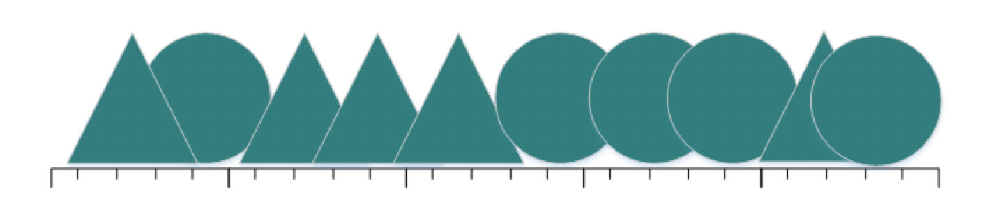
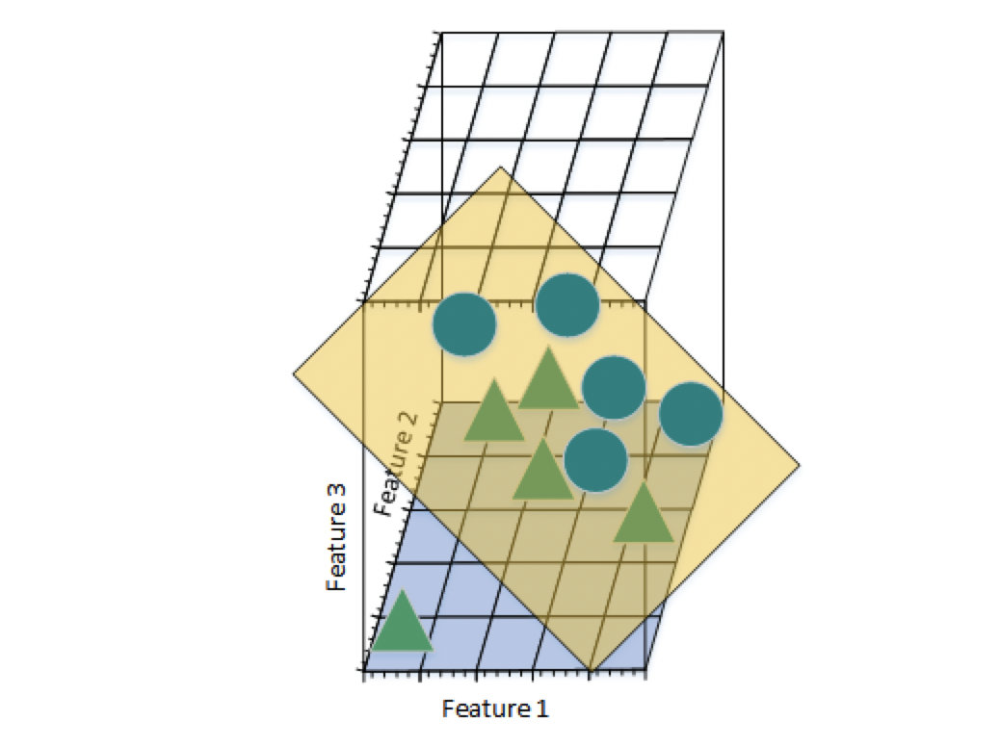

# 维数灾难

## 1. 高维的优点

很多数据样本在低维情况下是不可分的，比如下图所示：

然而在高维情况下，在低维不可分的样本就会变为可分了：

在高维训练出来的线性可分的情况其实就相当于在低维训练出了一个复杂的非线性分类器。

## 2. 高维的缺点

* 维度越高，对应的分类器就会越复杂，就会越容易出现过拟合问题。这是因为，对高维来说，如果要达到和低维同样密度，样本数量就会呈指数增长，所以高维的样本相对会非常稀疏，训练出来的分类器泛化能力比较弱。
* 另外，高维的稀疏并不是均匀分布的。越靠近中心，稀疏性就越明显。可以这么说，在高维情况下，绝大多数样本都是分布在空间边缘的，样本之间的间距会偏向无穷大，这样造成了分类的困难度。
* 所以，为了避免高维特征空间带来的诸多问题，我们需要把高维特征降到合理的特征维度空间。

## 3. 降维方法

1. 主成分分析法（PCA， Principle Components Analysis）
2. 线性判别分析LDA（Linear Discriminant Analysis）
3. 奇异值分解简化数据
4. 拉普拉斯特征映射
5. Lassio缩减系数法
6. 小波分析法

# 聚类算法

## 1. 定义

聚类是一种无监督算法，用于寻找数据的内在结构，将拥有相似内在结构的数据聚合成一类。

## 2. 衡量方法

* 算法的处理能力：处理大数据集的能力，即算法复杂度；处理噪声、异常点的能力；处理复杂数据结构的能力。
* 算法是否需要预设条件：比如聚类的簇数或者其他先验知识。
* 算法的数据输入属性：是否和数据输入顺序有关；是否对数据维数敏感，对数据类型有无要求等等。

## 3. 常用算法

### 3.1 K-means方法

算法流程：

输入：数据样本，数据数量n和簇数k。

输出：k个簇。

1. 随机选取k个数据样本作为k个簇的中心点。
2. 根据k个中心点划分n个数据样本。
3. 更新新簇的中心点。
4. 重复2和3知道簇中心不再变化。

### 3.2 层次聚类

层次聚类一般分为凝聚和分裂。凝聚是指先将每一个数据样本视为一个单独的簇，然后慢慢合并成更大的簇，知道满足条件。分裂一般是指先将所有的样本视为一个簇，然后慢慢分裂成小簇，直到满足条件。

下面以采用最小距离衡量的凝聚算法为例：

1. 将每个样本看做成一个簇，计算两两簇之间的样本最小距离。
2. 将最小距离最小的两个簇聚合成一个新簇。
3. 重新计算新簇与其他簇之间的最小距离。
4. 重复2和3，知道簇数满足条件。

# PCA简析

## 1. PCA原理简述

共有$m$个数据 $(\boldsymbol {x}_1, \boldsymbol {x}_2, ..., \boldsymbol {x}_m)$，每个数据的维度有 $n$维，即$\boldsymbol x_i=[x_{i1}, x_{i2}, ..., x_{in}]^{T}$。我们可以将数据组织成 $\boldsymbol X_{n*m}=[\boldsymbol {x}_1, \boldsymbol {x}_2, ..., \boldsymbol {x}_m]$，每一行代表一个数据维度，每一列代表一个数据条目。

PCA的目标就是能将 $n$维的数据压缩到 $k$维$(\boldsymbol {y}_1, \boldsymbol {y}_2, ..., \boldsymbol {y}_m)$，每个数据的维度有$k$维，即$\boldsymbol y_i=[y_{i1}, y_{i2}, ..., y_{ik}]^{T}$，我们可以将数据组织成$\boldsymbol Y_{k*m}=[\boldsymbol {y}_1, \boldsymbol {y}_2, ..., \boldsymbol {y}_m]$，从而实现数据分析上的一些简便性。相当于寻找一个变换矩阵 $\bold P_{k*n} = [\boldsymbol p_1^T, \boldsymbol p_2^T, ..., \boldsymbol p_k^T]^T$, $\boldsymbol p_i=[p_{i1}, p_{i2}, ..., p_{in}]$是一个正交基，使得$\bold Y_{k*m} = \bold P_{k*n}\bold X_{n*m}$。

但是维度降低之后必然会损失一些信息。PCA采取的措施是使得变换后的$\bold Y_{k*m}$各个维度的数据方差最大，即每个维度的数据最分散，并且使得各个维度的协方差最小，即各个维度之间相互独立。

如何进行数学推导来完成这个任务就是一个比较复杂并且神奇的地方了。

## 2. PCA数学基础

### 2.1 方差与协方差

方差衡量的是数据的分散程度(后面都是以第1维度为例)： 
$$
Var(x_{.1})=\frac 1 {m-1}\sum_{i=1}^{m}(x_{i1} - \overline x_{.1})^2=\frac 1 {m-1}\sum_{i=1}^{m}(x_{i1})^2
$$
协方差衡量的是不同维度之间的相关程度：
$$
Cov(x_{.1}, x_{.2})=\frac 1 {m-1}\sum _{i=1}^m(x_{i1} - \overline x_{.1})(x_{i2} - \overline x_{.2})=\frac 1 {m-1}\sum _{i=1}^m x_{i1}x_{i2}
$$
上述两式也体现出了为什么要对数据维度归一化，因为归一化之后协方差和方差表示起来都很简单。

我们先来看看为什么要求协方差矩阵？
$$
\bold C_{n*n} =\frac 1 {m-1} \bold X_{n*m} \bold X_{m*n}^{T} = \left\{
 \begin{matrix}
   Var(x_{.1}) & Cov(x_{.1}, x_{.2}) & Cov(x_{.1}, x_{.3}) \\
   Cov(x_{.2}, x_{.1}) & Var(x_{.2}) & Cov(x_{.2}, x_{.3}) \\
   Cov(x_{.3}, x_{.1}) & Cov(x_{.3}, x_{.2}) & Var(x_{.3})
  \end{matrix}
  \right\}
$$

$$
\bold C_{n*n}=\frac 1 {m-1} \sum _{i=1} ^m \boldsymbol  x_i \boldsymbol x_i ^ T \tag{另一种表示方法}
$$

可以看出来，协方差矩阵完美的包含了数各个维度的方差，以及相互之间的协方差，所以称为协方差矩阵。

同样：
$$
\bold D_{n*n} =\frac 1 {m-1} \bold Y_{k*m} \bold Y_{m*k}^{T} = \left\{
 \begin{matrix}
   Var(y_{.1}) & Cov(y_{.1}, y_{.2}) & Cov(y_{.1}, y_{.3}) \\
   Cov(y_{.2}, y_{.1}) & Var(y_{.2}) & Cov(y_{.2}, y_{.3}) \\
   Cov(y_{.3}, y_{.1}) & Cov(y_{.3}, y_{.2}) & Var(y_{.3})
  \end{matrix}
  \right\}
$$
所以到这里，PCA的优化目标就比较明确了。我们是希望变换后的 Dn∗nDn∗n能有尽量大的方差，即对角线元素尽量大，和为0的协方差，即其他元素为0。其实就是希望变换后的 Dn∗nDn∗n是对角阵。

### 2.2 如何求得变换矩阵

我们再看一下变换矩阵$\bold P_{k*n}$有什么特点。首先，它的每一行都是一个正交基，然后要将 原始数据$\bold X_{n*m}$变换成$\bold Y_{k*m}$，即$\bold Y_{k*m} = \bold P_{k*n}\bold X_{n*m}$。并且使得$\bold Y_{k*m}$的协方差矩阵是对角阵。

我们首先来看一下$\bold C_{n*n}$和$\bold D_{k*k}$的关系（为了方便省略了前面的系数$\frac 1 {m-1}$）：
$$
\bold D = \bold Y \bold Y^T=\bold P \bold X \bold X^T \bold P^T= \bold P \bold C \bold P^T
$$
如此，就可以通过这样的 $\bold P$来把 $$\bold C变换成对角阵$\bold D$。

我们知道$\bold C$是实对称矩阵，在数学里，可以找到一个$\bold P$，其中$\bold P$的每一行是$\bold C$的特征向量，使得$\bold D = \bold P \bold C \bold P^T$。

所以这样求出了满足条件的变换矩阵$\bold P$。我们只需要取得前$k$大的特征值对应的特征向量，就可以组成最终的变换矩阵$\bold P_{k*n} = [\boldsymbol p_1^T, \boldsymbol p_2^T, ..., \boldsymbol p_k^T]^T$, $\boldsymbol p_i=[p_{i1}, p_{i2}, ..., p_{in}]$是一个正交基，使得$\bold Y_{k*m} = \bold P_{k*n}\bold X_{n*m}$。

那么为什么选择前$k$大的特征值对应的特征向量组成的变换矩阵就可以视为主成分呢？原始的$n$个特征向量可以视作特征空间中选择的$n$个正交基，用这$n$个正交基就可以表示数据的所有维度了。每一个正交基对应一个数据维度，特征值小的特征向量对应的维度上的数据方差小(变换后的协方差矩阵的对角线元素)，可以视为次要成分。特征值大的维度可以视为主要成分。

## 3. PCA计算步骤

1. 计算数据矩阵$\boldsymbol X_{n*m}=[\boldsymbol {x}_1, \boldsymbol {x}_2, ..., \boldsymbol {x}_m]$，并且对每个维度进行0均值化。
2. 计算协方差矩阵$\bold C_{n*n} =\frac 1 {m-1} \bold X_{n*m} \bold X_{m*n}^{T}$。
3. 计算协方差矩阵对应的特征值和特征向量。
4. 按要求选择前$k$大的特征值及对应的特征向量，组成变换矩阵$\bold P_{k*n} = [\boldsymbol p_1^T, \boldsymbol p_2^T, ..., \boldsymbol p_k^T]^T$。
5. 计算变换后的数据$\bold Y_{k*m} = \bold P_{k*n}\bold X_{n*m}$。

## 4. PCA优缺点

### 优点：

1. 是以方差进行衡量的无监督学习方法，不受样本标签限制。
2. 各个主成分之间相互正交，可以消除原始数据各个维度之间的相关信息。
3. 计算方法简单，易于实现。

### 缺点：

1. 主成分的各个维度的解释比较模糊，可解释性不如原始维度。
2. 方差小的非主成分也可能有一些特异的信息。
3. PCA实现的算法复杂度过高。
4. 因为本身没有参数，所以算法通用性比较强，但是个性化优化比较差。
5. PCA其实是假设数据符合高斯分布，但是如果数据分布明显不是高斯分布，计算出来的主成分可能不是最优的。
6. PCA其实依赖方差信息，在样本区别在均值而不是方差时效果较差。

## 5. KPCA

KPCA (Kernel PCA)是指利用核函数的PCA。由于PCA挖掘的数据内部的线性关系，对于非线性关系往往无能为力。

为了更好地处理非线性数据，引入了一个隐性的非线性核函数$Φ$，将原始数据 XX映射到高维空间$Φ(X)$，然后和SVM一样，对于变换后的数据应用PCA主成分分析。

# LDA简析?

## 1. LDA原理简述

LDA是一种监督学习，利用数据的标签信息对数据进行压缩。同样假设有$m$条数据，每个数据有$n$维：
$$
((\boldsymbol x_1, y_1), (\boldsymbol x_2, y_2), ..., (\boldsymbol x_m, y_m))\\
\boldsymbol x_i = [x_{i1}, x_{i2}, ..., x_{in}]^T, y_i=\{1, 2, ..., c\}
$$
LDA的主要目标是寻找一个变换矩阵$\bold W_{n*k}$，使得变换后的数据维度为$k$维，我们同样用$\bold X_{n*m}=[\boldsymbol x_{1}, \boldsymbol x_{2},..., \boldsymbol x_{m}]$, $\widetilde{\mathbf{X}}_{n * m}=\left[\widetilde{\boldsymbol{x}}_{1}, \widetilde{\boldsymbol{x}}_{2}, \ldots, \widetilde{\boldsymbol{x}}_{m}\right]$表示变换前和变换后的数据组合。
$$
\widetilde{\mathbf{X}}_{k * m}=\mathbf{W}_{k * n}^{T} \mathbf{X}_{n * m}, \quad \widetilde{\mathbf{x}}_{k * 1}=\mathbf{W}_{k * n}^{T} \mathbf{x}_{n * 1}
$$
LDA的主要原理是使得变换后的数据同类数据拥有尽量小的方差，即同类数据尽量集中，不同类别间的数据中心值具有尽量大的方差，即不同类数据尽量分散。

## 2. LDA数学基础

在进行数学推导之前，先定义一些基本数据格式：

$\bold X_i,\bold m_i$：表示类型为 ii的数据的组合和数量。

$\boldsymbol{\mu}_{i}=\frac{1}{\mathbf{m}_{i}} \sum_{\boldsymbol{x}_{j} \in \mathbf{X}_{i}} \boldsymbol{x}_{j}, \widetilde{\boldsymbol{\mu}}_{i}=\frac{1}{\mathbf{m}_{i}} \sum_{\boldsymbol{x}_{j} \in \mathbf{X}_{i}} \widetilde{\boldsymbol{x}}_{j}$：分别表示变换前后第$i$类数据的中心。

$\boldsymbol{\mu}=\frac{1}{m} \sum_{i=1}^{m} \boldsymbol{x}_{i}, \quad \widetilde{\boldsymbol{\mu}}=\frac{1}{\boldsymbol{m}} \sum_{i=1}^{m} \widetilde{\boldsymbol{x}}_{i}$：表示整体数据变换前后的中心。
$$
\begin{array}{c}{\mathbf{S}_{\mathbf{W}}=\sum_{i=1}^{c} \mathbf{S}_{i}^{2}=\sum_{i=1}^{c} \sum_{\boldsymbol{x}_{j} \in \mathbf{X}_{i}}\left(\boldsymbol{x}_{j}-\boldsymbol{\mu}_{i}\right)\left(\boldsymbol{x}_{j}-\boldsymbol{\mu}_{i}\right)^{T}} \\ {\mathbf{S}_{\mathbf{B}}=\sum_{i=1}^{c} m_{i}\left(\boldsymbol{\mu}_{i}-\boldsymbol{\mu}\right)\left(\boldsymbol{\mu}_{i}-\boldsymbol{\mu}\right)^{T}}\end{array}
$$
上述两个式子分别表示类内散列矩阵和类间散列矩阵，后面推导的时候会用到。

我们先明确我们的优化目标：**希望最大化类间中心值方差，最小化类内方差**。

类间中心值方差$\widetilde{\mathbf{S}}_{\mathbf{B}}=\sum_{i=1}^{c} m_{i}\left(\widetilde{\boldsymbol{\mu}}_{i}-\widetilde{\boldsymbol{\mu}}\right)\left(\widetilde{\boldsymbol{\mu}}_{i}-\widetilde{\boldsymbol{\mu}}\right)^{T}$，

类内方差$\widetilde{\mathbf{S}}_{\mathbf{W}}=\sum_{i=1}^{c} \widetilde{\mathbf{S}}_{i}^{2}=\sum_{i=1}^{c} \sum_{\boldsymbol{x}_{j} \in \mathbf{X}_{i}}\left(\widetilde{\boldsymbol{x}}_{j}-\widetilde{\boldsymbol{\mu}}_{i}\right)\left(\widetilde{\boldsymbol{x}}_{j}-\widetilde{\boldsymbol{\mu}}_{i}\right)^{T}$

注意此时$\tilde{\mathbf{S}}_{\mathrm{B}}, \tilde{\mathrm{S}}_{\mathrm{W}}$都是矩阵形式，其中一个替换方式为替换成**最大化对角线元素的乘积**。

所以优化目标可以表示为最大化(具体中间的推导过程省略)：
$$
\mathbf{J}(\mathbf{W})=\frac{\prod_{d i a g} \tilde{\mathbf{S}}_{\mathbf{B}}}{\prod_{d i a g} \widetilde{\mathbf{S}}_{\mathbf{W}}}=\frac{\prod_{\text {diag}} \mathbf{W}^{T} \mathbf{S}_{\mathbf{B}} \mathbf{W}}{\prod_{d i a g} \mathbf{W}^{T} \mathbf{S}_{\mathbf{W}} \mathbf{W}}=\prod_{i=1}^{k} \frac{\mathbf{w}_{i}^{T} \mathbf{S}_{\mathbf{B}} \mathbf{w}_{i}}{\mathbf{w}_{i}^{T} \mathbf{S}_{\mathbf{W}} \mathbf{w}_{i}}
$$
观察上式中的每一项，其实是广义瑞利商，最大值就是$\mathbf{S}_{\mathbf{W}}^{-1} \mathbf{S}_{\mathbf{B}}$对应的最大$k$个特征值的乘积，对应的$\bold W_{n*k}$就是对应的特征向量。

另一种优化目标可以转换为**最大化行列式**：
$$
\mathbf{J}(\mathbf{W})=\frac{\left|\widetilde{\mathbf{S}}_{\mathbf{B}}\right|}{\left|\widetilde{\mathbf{S}}_{\mathbf{W}}\right|}=\frac{\left|\mathbf{W}^{T} \mathbf{S}_{\mathbf{B}} \mathbf{W}\right|}{\left|\mathbf{W}^{T} \mathbf{S}_{\mathbf{W}} \mathbf{W}\right|}
$$
因为 对于上式是有无数解的，故可以限制分母为1，利用拉格朗日乘子法可以得到：
$$
L(\lambda, \mathbf{W})=\mathbf{W}^{T} \mathbf{S}_{\mathrm{B}} \mathbf{W}-\lambda\left(\mathbf{W}^{T} \mathbf{S}_{\mathbf{W}} \mathbf{W}-\mathbf{I}\right)
$$
对这个公式进行求导可以得到：$\mathbf{S}_{\mathbf{B}} \mathbf{W}=\lambda \mathbf{S}_{\mathbf{W}} \mathbf{W}$，即$\bold {S_W^{-1}S_BW}=\lambda \bold W$，即$\bold W_{n*k}$的每一列都是$\bold {S_W^{-1}S_B}$的特征向量。这样，就求得了变换矩阵，对原始数据应用变换矩阵，就可以得到降维后的数据。

因为$\bold S_B$的计算方式，导致其最大秩为$c$，而其中$c$个$\mu_j$其实自由度为$c-1$，所以$\bold S_B$的最大秩为$c-1$，故特征向量最多有$c-1$个，所以降维后的维度最大值为$c-1$。

## 3. LDA计算步骤

1. 计算$\bold {S_W}=\sum _{i=1} ^{c} \bold S_i^2= \sum _{i=1}^{c} \sum _{\boldsymbol x_j \in \bold X_i} (\boldsymbol x_j - \boldsymbol \mu_i)(\boldsymbol x_j - \boldsymbol \mu_i)^T$和

   计算$\bold {S_B}=\sum_{i=1}^{c} m_{i}\left(\boldsymbol {\mu}_{i}-\boldsymbol\mu\right)\left(\boldsymbol\mu_{i}-\boldsymbol\mu\right)^{T}$，得到$\bold {S_W^{-1}S_B}$。

2. 对$\bold {S_W^{-1}S_B}$进行特征值分解，得到最大的前$k$个特征值和对应的特征向量，得到变换矩阵$\bold W_{n*k}$。

3. 对原始数据进行变换$\widetilde{\mathbf{X}}_{k * m}=\mathbf{W}_{k * n}^{T} \mathbf{X}_{n * m}$，得到变换后的数据。

## 4. LDA优缺点

### 优点：

1. 可以充分利用标签信息进行降维，更能反映样本间的差异。

### 缺点：

1. 不适合对非高斯分布的数据进行降维。
2. LDA维度最多降到$c-1$维，不能再高了。
3. LDA样本分类信息依赖方差而不是均值时效果不好。
4. LDA可能会过度拟合数据。
5. 当样本数量远小于特征维度时，距离度量会变得失效，所以LDA小效果往往不好。

# 参考资料

1. [PCA的数学原理](http://blog.codinglabs.org/articles/pca-tutorial.html)
2. [机器学习中的数学(4)-线性判别分析（LDA）, 主成分分析(PCA)](https://www.cnblogs.com/LeftNotEasy/archive/2011/01/08/lda-and-pca-machine-learning.html)