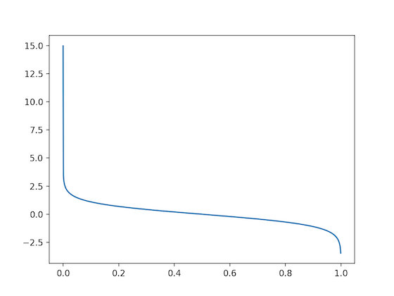

# 1. 概述

##1.1 分类

集成学习（Ensemble Learning）是一类机器学习算法的统称，是通过构建多个个体学习器来完成任务。集成学习在机器学习领域应用的非常广泛，因为它集成了各类算法的优点，效果也非常好。

集成学习一般有两种，根据个体学习器之间是否同质分为两种。一种是所有个体学习器都是同质算法，比如都是LR或者都是贝叶斯分类器；第二种是个体学习器是不同种类的算法，比如有的是LR，有的是决策树。目前应用比较广泛的是同质个体学习器的集成学习方法。

同质个体学习器又根据个体学习器之间是否存在依赖关系分为两类：第一类是个体学习器之间存在依赖关系，一系列个体学习器基本需要串行生成，代表算法有Boosting系列算法；第二类是个体学习器之间不存在依赖关系，可以并行生成，代表算法有Bagging和随机森林（Random Forest）算法。

下图表示了各个集成算法之间的逻辑关系：

## 1.2 算法概述

### 1.2.1 Boosting系列

Boosting系列算法的主体思想是：先从数据集用初始权重训练一个个体学习器，根据这个个体学习器的误差率来更新样本的权重，一般是提高分类错误的样本权重，降低分类准确的样本权重。然后再根据新的权重来训练下一个个体学习器。如此循环直到满足要求，最后集成所有的个体学习器。

### 1.2.2 Bagging系列

Bagging系列算法的主体思想是：通过不同的训练集并行训练不同的个体学习器。不同的训练集是通过对原始训练集随机采样得到的，然后再对所有的个体学习器进行集成。

随机采样一般采取自助采样法（Boostrap Sampling），也就是对于m个样本的原始训练集，有放回采样m次，形成m个样本的新训练集，这样，采样的新训练集既有重叠又有不同。

随机森林是Bagging的一个特化进阶版，个体学习器都是决策树，在Bagging随机采样基础上，加上了**特征的随机选择**，但基本思想还是Bagging的思想。

## 1.3 集合策略

如何把个体学习器结合在一起呢？假设得到的弱学习器集合为：$\{h_1, h_2, …, h_T\}$。

### 1.3.1 平均法

对于数值类型的回归问题，一般会使用平均法来集成各个个体学习器。也就是说，对各个个体学习器的预测结果进行平均得到最终的结果。最简单的是算术平均，一般每个个体学习器都有一个权重，来表示个体学习器的好坏程度。则集成结果可以表示为：
$$
H(x)=\sum _{i=1}^{T} w_ih_i(x)
$$
$w_i$代表相应的个体学习器的权重。

### 1.3.2 投票法

对于分类问题的预测，我们可以让T个个体学习器对结果进行投票，然后综合投票结果产生最终的分类结果。一般投票规则有：相对多数，得票最多的那一类作为最终预测结果；绝对多数，只有某一类得到绝对多数（比如超过50%）的票数时，才判定为这一结果，否则拒绝作出判断。更复杂一点的有，为每个学习器学习一个权重参数，最后进行加权投票。

### 1.3.3 学习法

我们为每个个体学习器的结果再加一层学习器。也就是以个体学习器的结果作为输入，将训练集的真实结果作为输出，为从各个个体结果生成最终结果学习一个学习器，称为次级学习器。每个个体学习器称为初级学习器。

# 2. AdaBoost

AdaBoost是Boosting系列算法中的一个代表。如果使用Boosting系列算法思想，则需要解决如下几个问题：

* 如何计算每个弱学习器的误差率$e_k$。
* 如何得到每个弱学习器的权重系数$\alpha_k$。
* 在每一步，如何更新样本权重$\{w_k1, w_k2, …, w_km\}$。
* 如何根据弱学习器集成强学习器。

## 2.1 AdaBoost基本思路

假设我们的训练样本是：$D=\{(\boldsymbol x_1, y_1), (\boldsymbol x_2, y_2), …, (\boldsymbol x_m, y_m)\}$。

训练集样本在第$k$个弱学习器上的样本权重为：$D(k)=(w_{k1}, w_{k2}, …, w_{km})$。

第$k$个弱学习器为：$G_k(·)$。

对AdaBoost（二）分类问题，输出$y=\{+1, -1\}$：

* 第$k$个弱学习器的误差率为：$e_k=\sum_{i=1}^m w_{ki}I(y_i \ne G_k(\boldsymbol x_i))$。

  * 误差率范围在$[0, 1]$之间，反映了弱学习器的加权错误率。

* 权重系数为：$\alpha_k=\frac 1 2log(\frac {1-e_k} {e_k})$。

  

  * 上图是$\alpha_k$随$e_k$变化的图像，可知，当误差率$e_k$越高时，权重$\alpha_k$越小。当误差率为$\frac 1 2$时，权重刚好为0，当误差率小于$\frac 1 2$时，权重大于0，当误差率大于$\frac 1 2$时，权重小于0。

* 权重更新公式如下所示：
  $$
  w_{(k+1)i}=\frac {w_{ki}e^{-\alpha _ky_iG_k(\boldsymbol x_i)}} 
  {\sum_{i=1}^{m}{w_{ki}e^{-\alpha _ky_iG_k(\boldsymbol x_i)}}}
  $$

  * 从上式可以看到：当预测上次的$\boldsymbol x_i$预测正确时，权重系数变为$w_{ki}e^{-\alpha_k}$，系数就会变小，反之，系数则变大（这里默认$\alpha_k > 0$？）。

* 集成策略为加权投票，最终的强分类器$f(x)$为：
  $$
  f(x)=\operatorname{sign}\left(\sum_{k=1}^{K} \alpha_{k} G_{k}(x)\right)
  $$
  

对AdaBoost回归问题而言：

* 第$k$个弱学习器的误差率为：

  * 首先计算在训练集上的最大误差：$E_{k}=\max \left|y_{i}-G_{k}\left(x_{i}\right)\right| i=1,2 \ldots m$；
  * 然后计算每个样本的相对误差：
    * 如果误差损失为线性：$e_{k i}=\frac{\left|y_{i}-G_{k}\left(x_{i}\right)\right|}{E_{k}}$；
    * 如果误差损失为平方：$e_{k i}=\frac{\left(y_{i}-G_{k}\left(x_{i}\right)\right)^{2}}{E_{k}^{2}}$；
    * 如果误差损失为指数：$e_{k i}=1-\exp \left(\frac{-y_{i}+G_{k}\left(x_{i}\right) )}{E_{k}}\right)$；
  * 最后计算误差率：$e_{k}=\sum_{i=1}^{m} w_{k i} e_{k i}$。

* 权重系数为：$\alpha_{k}=\frac{e_{k}}{1-e_{k}}$；

* 权重更新如下：
  $$
  w_{(k+1)i}=\frac {w_{ki}\alpha_k^{1-e_{ki}}}
  {\sum _{i=1}^{m} w_{ki}\alpha_k^{1-e_{ki}}}
  $$

* 结合策略是采用所有弱学习器中的权重中位数对应的弱学习器作为最终强学习器的输出结果。

## 2.2 损失函数问题

分类问题中，不同弱学习器的损失函数相当于是：指数损失。

回归问题中，损失函数可以选择不同类型的损失函数。

## 2.3 算法流程

**分类算法流程**：

1. 初始化样本权重为：
   $$
   D(1)=(w_{11}, w_{12}, ...  w_{1m}), w_1i=\frac{1}{m}, i=1, 2, ..., m.
   $$

2. 对于$k=1, 2, …, K$：

   1. 使用具有权重$D(k)$的训练集样本来训练弱学习器$G_k(x)$；
   2. 计算$G_k(x)$的学习误差率：$e_k=\sum_{i=1}^{m} w_{k i} I\left(G_{k}\left(\boldsymbol x_{i}\right) \neq y_{i}\right)$；
   3. 计算$G_k(x)$的权重：$\alpha_{k}=\frac{1}{2} \log \frac{1-e_{k}}{e_{k}}$；
   4. 更新样本权重集的分布：$w_{(k+1)i}=\frac {w_{ki}e^{-\alpha _ky_iG_k(\boldsymbol x_i)}} 
      {\sum_{i=1}^{m}{w_{ki}e^{-\alpha _ky_iG_k(\boldsymbol x_i)}}}$；

3. 构建最终的强分类器：
   $$
   f(x)=\operatorname{sign}\left(\sum_{k=1}^{K} \alpha_{k} G_{k}(x)\right)
   $$
   对于多分类问题，上述过程基本都是一样的，唯一的区别在于学习器的权重系数，例如SAMME中权重为：
   $$
   \alpha_{k}=\frac{1}{2} \log \frac{1-e_{k}}{e_{k}}+\log (R-1)
   $$
   R为分类数。

   

**回归算法流程**：

1. 初始化样本权重为：
   $$
   D(1)=(w_{11}, w_{12}, ...  w_{1m}), w_1i=\frac{1}{m}, i=1, 2, ..., m.
   $$

2. 对于$k=1, 2, …, K$：

   1. 使用具有权重$D(k)$的训练集样本来训练弱学习器$G_k(x)$；

   2. 计算在训练集上的最大误差：$E_{k}=\max \left|y_{i}-G_{k}\left(x_{i}\right)\right| i=1,2 \ldots m$；

   3. 然后计算每个样本的相对误差：

      - 如果误差损失为线性：$e_{k i}=\frac{\left|y_{i}-G_{k}\left(x_{i}\right)\right|}{E_{k}}$；
      - 如果误差损失为平方：$e_{k i}=\frac{\left(y_{i}-G_{k}\left(x_{i}\right)\right)^{2}}{E_{k}^{2}}$；
      - 如果误差损失为指数：$e_{k i}=1-\exp \left(\frac{-y_{i}+G_{k}\left(x_{i}\right) )}{E_{k}}\right)$；

   4. 计算回归误差率：$e_{k}=\sum_{i=1}^{m} w_{k i} e_{k i}$；

   5. 计算学习器系数：$\alpha_{k}=\frac{1}{2} \log \frac{1-e_{k}}{e_{k}}$；

   6. 更新样本权重集：
      $$
      w_{(k+1)i}=\frac {w_{ki}\alpha_k^{1-e_{ki}}}
      {\sum _{i=1}^{m} w_{ki}\alpha_k^{1-e_{ki}}}
      $$

3. 构建最终的强学习器：
   $$
   f(x)=G_{k^{*}}(x)
   $$
   其中$k^*$是所有学习器权重中位数对应的学习器序号。

## 2.4 正则化

为了防止AdaBoost算法过拟合，通常会采取手段防止过拟合，正则化就是常用的手段。在AdaBoost中，正则化项被称为步长，原本的强学习构成如下所示：
$$
f_{k}(x)=f_{k-1}(x)+\alpha_{k} G_{k}(x)
$$
加上正则化步长之后变为：
$$
f_{k}(x)=f_{k-1}(x)+\nu \alpha_{k} G_{k}(x)
$$
步长$\nu$的取值范围为：$(0, 1]$，步长越小，说明正则化程度越大，需要更多的弱学习器。一般来说，学习器越多，越容易过拟合，学习器越少，越容易欠拟合。

## 2.5 优缺点

**优点**：

* AdaBoost作为分类器时，分类精度很高；
* 可以利用各种回归分类算法来构建弱学习器，灵活性高；
* 在作为简单的二分类器时，构造简单，结果可理解；
* 不易发生过拟合。

**缺点**：

* 对异常样本非常敏感，异常样本在迭代中容易获得极高权重，从而影响最终分类器的分类效果。
* 弱分类器需要支持加样本权重的分类，所以回归任务一般采取CART回归决策树，分类任务一般采取CART分类树和神经网络。

# 3. GBDT

## 3.1 整体框架

假设样本是：$((\boldsymbol x_1, y_1), (\boldsymbol x_2, y_2), …, (\boldsymbol x_m, y_m))$

假设第$t$轮的弱学习器的函数表示为：$f_t(\boldsymbol x_i)$，则每一轮强学习器的输出可以表示为：

$\hat y_i^0=0$

$\hat y_i^1=f_1(\boldsymbol x_i)=\hat y_i^0+f_1(\boldsymbol x_i)$

$\hat y_i^2=f_1(\boldsymbol x_i) + f_2(\boldsymbol x_i)= \hat y_i^1 + f_2(\boldsymbol x_i)$

$...$

$\hat{y}_{i}^{t}=\sum_{k=1}^{t} f_{k}\left(\boldsymbol x_{i}\right)=\hat{y}_{i}^{t-1}+f_{t}\left(\boldsymbol x_{i}\right)$

也相当于是第$t$轮的强学习器是由前$t$个弱学习器的加法输出表示。

那么对于第$t$轮的强学习器的输出：$\hat{y}_{i}^{t}=\hat{y}_{i}^{t-1} + f_t(\boldsymbol x_i)$，相当于是前一轮的强学习器的输出$\hat{y}_{i}^{t-1}$加上本轮的弱学习器的输出$f_t(\boldsymbol x_i)$。那么，如何去优化每一轮的弱学习器呢？对于AdaBoost来说，是通过拟合对应权重的样本来优化每一轮的数据样本。对于GBDT来说，则是通过拟合前一轮强学习器的负梯度来实现的。具体如何实现，下面将具体说明：

假设我们的损失函数定义为$l\left(y_{i}, \hat{y}_{i}^{t-1}\right)$，这一项表示了我们如何去衡量上一轮强学习器输出的损失；正则化项表示为$\Omega\left(f_{t}\right)$，这一项表示了正则化的目标函数。那么我们这一轮的优化目标函数就变成了：
$$
\begin{aligned} O b j^{(t)} &=\sum_{i=1}^{m} l\left(y_{i}, \hat{y}_{i}^{t}\right)+\sum_{j=1}^{t} \Omega\left(f_{i}\right) \\ &=\sum_{i=1}^{m} l\left(y_{i}, \hat{y}_{i}^{t-1}+f_{t}\left(\boldsymbol x_{i}\right)\right)+\Omega\left(f_{t}\right)+\text {constant } \end{aligned}
$$
对于上式，我们可以观察发现：$y_i^{t-1}$是上一轮的强学习器的输出，是一个常数；$f_t(\boldsymbol x_i)$则是我们这一轮的弱学习器需要去拟合的数据。我们可以利用泰勒展开讲上式的目标函数展开为：
$$
O b j^{(t)}\approx \sum_{i=1}^{m}\left[l\left(y_{i}, \hat{y}_{i}^{t-1}\right)+g_{i} f_{t}\left(\boldsymbol x_{i}\right)\right]+\Omega\left(f_{t}\right)+\text {constant }
$$
其中，$g_i=\frac {\partial l(y_i, \hat y_i^{t-1})}{\partial \hat y_i^{t-1}}$，相当于是一阶导数，GDBT是用一阶导数去近似拟合损失函数的。在这里说明一下，为什么我们要用泰勒展开去近似表示目标函数，而不是直接使用目标函数来做优化呢？这是因为如果直接优化目标函数，我们需要将$t$层的弱学习器和$t-1$层的强学习器的输出加在一起作为整体输出来计算损失函数，计算很麻烦。如果使用泰勒展开以后就会发现，我们还可以直接利用上一层的损失函数的信息，本层损失函数只需要计算本层输出就可以了。

上式可以进一步化简为：
$$
O b j^{(t)}\approx \sum_{i=1}^{m}g_{i} f_{t}\left(\boldsymbol x_{i}\right)+\Omega\left(f_{t}\right)+\text {constant }
$$
这样，我们就表示出了本层的目标函数，本层的弱学习器的目标就是最小化这个目标函数。

## 3.2 使用决策树

在使用CART回归树作为弱学习器时，我们先来看一下步骤是怎么样的：

1. 在每个节点确定所有可以用的特征。对每个特征确定所有可能的分裂点，把样本划分为两个集合。
2. 计算分裂前和分裂后目标函数的大小，对每个特征确定最好的分裂点，再选出最好的分裂特征。
3. 开始分裂节点，直到满足特定条件。
4. 对每个叶子结点确定预测值。

我们来看一下如何利用目标函数来实现GBDT。如果使用CART回归树，我们需要确定几个问题：

* 如何确定节点的预测值（分为分裂节点计算增益时和叶子结点真实预测两种情景）。
  * CART回归树本身算法是选取均值或者中位数。在应用到GBDT算法上时，这个预测值需要使得目标函数最小。

* 如何选择最优属性作为本次节点的分裂属性。
  * CART回归树本身的算法是利用特征将数据样本划分为两个集合，使两个集合的标签方差之和最小。那么，在应用到GBDT算法上时，则需要对比较分裂前和分裂后目标函数的值的变化。

所以经过上述分析，我们的目标是根据目标函数来确定预测值和根据样本以及预测值来确定目标函数的取值。

首先，我们知道对于一个节点而言，预测值当然只有一个。那么假设对于节点$j$预测结果是$w_j$。正则化项$\Omega\left(f_{t}\right)=\gamma T+\frac{1}{2} \lambda \sum_{j=1}^{T} w_{j}^{2}$。那么，目标函数就可以表达为：
$$
Obj^t=\sum_{j=1}^{T}\left[\left(\sum_{i \in I_{j}} g_{i}\right) w_{j}+\frac{1}{2}\lambda w_{j}^{2}\right]+\gamma T
$$
如果设$G_{j}=\sum_{i \in I_{j}} g_{i}$，则
$$
Obj^t=\sum_{j=1}^{T}\left[G_j w_{j}+\frac{1}{2}\lambda w_{j}^{2}\right]+\gamma T
$$
因为除$w_j$之外，其他值都是确定的，所以
$$
w_{j}^{*}=-\frac{G_{j}}{\lambda}
$$
代入目标函数可得：
$$
O b j=-\frac{1}{2} \sum_{j=1}^{T} \frac{G_{j}^{2}}{\lambda}+\gamma T
$$
这样，目标函数和预测值都确定了，我们来看分裂前后目标函数的变化。分别用$G_L, G_R$来表示分裂后左右两个叶子结点的$G_j$。则分裂前目标函数的值为：
$$
-\frac{1}{2}\left[\frac{\left(G_{L}+G_{R}\right)^{2}}{\lambda}\right]+\gamma
$$
分裂后目标函数的值为：
$$
-\frac{1}{2}\left[\frac{G_{L}^{2} +G_{R}^{2}}{\lambda}\right]+2 \gamma
$$
直接选取分裂后目标函数值最大的最优划分点和最优划分属性就好了。

## 3.3 算法流程

1. 利用前一步的弱学习器产生的$\hat y_i^{t-1}$计算每一个样本的损失函数$l(y_i, \hat y_i^{t-1})$，并计算一阶导数$g_i=\frac {\partial l(y_i, \hat y_i^{t-1})}{\partial \hat y_i^{t-1}}$。
2. 生成本轮新的弱学习器。
   1. 在每一个节点处，根据节点样本确定可用的特征以及划分点。
   2. 对每一个特征和每一个划分点，计算目标函数的值，选择目标函数最小的值作为最优划分属性和最优划分点，进行分裂。
   3. 直到不能分裂为止。
3. 根据公式，产生每个叶子结点的预测值。为本轮的弱学习器生成每个节点的本轮输出$f_t(\boldsymbol x_i)$，并且生成本轮的强学习器输出$\hat y_i^{t}=\hat y_i^{t-1} + \epsilon f_t(\boldsymbol x_i)$。
4. 继续下一轮弱学习器的生成直到满足条件。

## 3.4 分类问题

分类问题最主要的区别是：输出是离散的类别。这时有两种处理方法：

* 选择指数损失或者对数损失作为损失函数。
* 直接拟合分类概率，转换为回归问题。

## 3.5 优缺点

优点：

* 可以灵活处理各种类别的数据，包括连续值和离散值。
* 可以使用一些更加健壮的损失函数，比如Huber损失函数。

缺点：

* 弱学习器存在依赖关系，不能并行训练。

* 平方损失函数（也就是残差）对于异常值过于敏感。

  （GDBT如果使用平方差损失函数，其实就相当于对上一步强学习器的残差进行拟合）

## 3.6 GBDT和xgboost的区别

* 传统的GBDT以CART树作为基学习器，XGBoost还支持线性分类器，这个时候XGBoost相当于L1和L2正则化的逻辑斯蒂回归（分类）或者线性回归（回归）。
* GBDT使用的是一阶导数的信息，xgboost则是使用了代价函数的二阶导数信息。
* xgboost加入了正则化，而传统的GBDT没有（虽然在论述里有）。
* xbgboost支持类似于随机森林的特征随机选择，可以降低方差，防止过拟合。
* 在并行计算上有一些优化。存储特征排序的信息（用于选择划分点）。

# 4. Bagging

Bagging算法是：对每一个基学习器采样出不同的数据样本（有放回采样），然后训练相应的基学习器。最后使用投票或者简单平均方法来决策。

## 4.1 随机森林

随机森林基本和Bagging的思想是类似的，不过：

- 在构建每一步的基学习器的时候，随机选定一组特征，划分特征都在这组特征里选。这样，肯定会在一定程度上加大单个基学习器的偏差。但由于要整体取平均，所以会降低偏差的影响，并减小方差。

随机森林的优缺点：

优点：

- 表现良好，提高泛化能力。
- 容易并行。

缺点：

- 在学习器较少时，效果较差，因为偏差较大。
- 在噪声较大的数据集上容易过拟合。

# 5. Stacking

Stacking主要思想是：先训练$k$个弱学习器，然后对每个样本得到$k$个输出，把这$k$个输出重新聚合成新的特征向量$x_i^{'}=[y_{i1}, y_{i2}, …, y_{ik}]$，然后组成新的训练集$(x_i^{'}, y_i)$训练元学习器，得到最终的输出。

stacking方法通常是使用异质的基学习器。

# Boosting与Bagging区别

* Bagging注重降低基学习器的方差，而Boosting注重降低基学习器的偏差。

