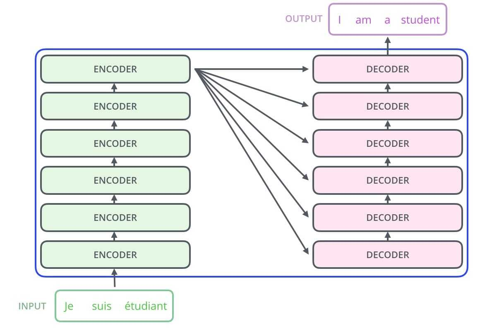
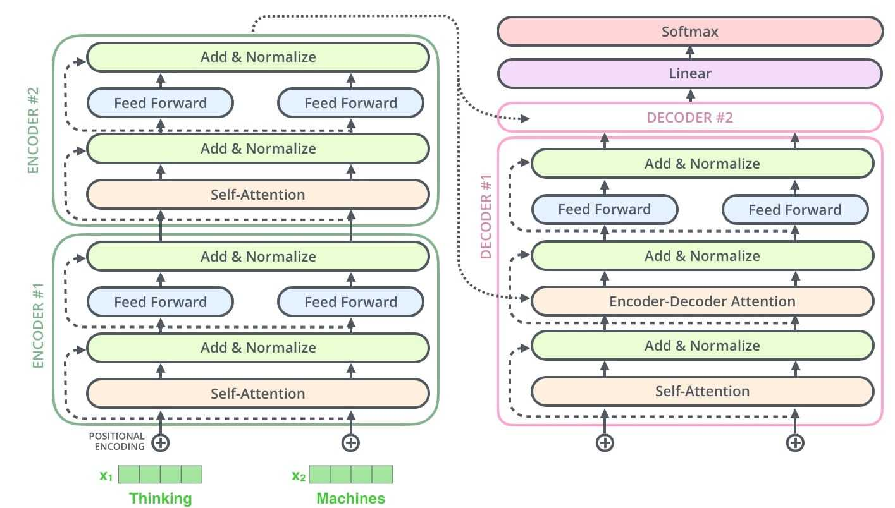

# Transformer

## 1. 模型结构概览

Transformer包括Encoder和Decoder两部分，如下图所示：

## 2. Encoder数据流动

**输入**：输入假设用X表示，共m个单词，假设输入维度为512维，X本身由原始的词向量加上位置向量得到：
$$
X_{(m, 512)} = X_{position} + X_{token}
$$
**Query**, **Key** and **Value**: 
$$
Q_{(m, 64)} = XW_{(512, 64)}^{Q} ,\qquad K = XW^{K} , \qquad Q = XW^{K}
$$

$$
\left(\begin{array}{c}{Q_{1}} \\ {Q_{2}} \\ {\vdots} \\ {Q_{m}}\end{array}\right)=\left(\begin{array}{c}{X_{1}} \\ {X_{2}} \\ {\vdots} \\ {X_{m}}\end{array}\right) W^{Q}
$$

**Self Attention**
$$
Z_i=\text { Attention }(Q, K, V)=\operatorname{softmax}\left(\frac{Q K^{T}}{\sqrt{d_{k}}}\right) V
$$
其实就是以Q为目标，K，V是一样的，用V的值根据与Q的Attention重新组合得到新的Q，也就是$Z_i$。

**Multi-Head and Feed Forward**  
$$
Z_{(m, 512)} = Concat(Z_1, Z_2, .., Z_8)_{(m, 512)}W_{(512, 512)}^O
$$
这就是最终输出的Encoder结果。

## 3. Decoder数据流动

在Encoder得到最终输出后$Encoder_z$后，最后一层的输出可以作为翻译的编码，传到Decoder的每一层中去。多层Decoder的输出最后可以映射到输出句子上去。

假设最终需要翻译的句子为：$[Y_1, Y_2, …, Y_{n-1}]$，则训练的时候Decoder输入为$[SOS, Y_1, Y_2, …, Y_{(n-1)}]$。

**输入**：$Y_{(n, 512)}$，由原本的句子向右移位再加上句子开始标志组成的。预计的输出为$[Y_1, Y_2, …, Y_{(n-1)}, EOS]$，就是输入的错位预测。

**Self-Attention**：
$$
Z_i=\text { Attention }(Q, K, V)=\operatorname{softmax}\left(\frac{Q K^{T}}{\sqrt{d_{k}}}\right) V
$$
基本操作和Encoder是一样的，不同的地方是：

在进行Attention计算的时候，要给$\operatorname{softmax}\left(\frac{Q K^{T}}{\sqrt{d_{k}}}\right) $矩阵乘以一个下三角单位矩阵，使得该位置上只编码该位置以及之前位置的单词信息，防止看到后面要预测的单词信息。

**Encoder-Decoder Attention**：

Decoder不同的地方还在于多了这一步，这一步的K，V是Encoder输出，假设分别为$[K_1, K_2, …, K_m]$, $[V_1, V_2, …, V_m]$ ，而Q则保持Decoder的上层数据流动，假设为$[Q_1, Q_2, …, Q_n]$, $Q_i$都只编码了$i$位置之前的单词信息。而再利用这样的Attention计算，就可以得到Attention的结果，每个位置都编码了要翻译的句子之前的单词信息以及Encoder输出的信息。

其余部分都和Encoder一样，不一样的还在于整个Decoder编码结束后，假设产生$[Z_1, Z-2, …, Z_n]$，将其通过一个全连接层，再进行Soft Max成和词库一样大的向量，就可以与预测单词了。

最终测试的时候，由于没有要翻译的句子，所以Decoder就退化成了RNN类似的结构，$t$时刻输入一个单词$TOKEN_t$，第一个是SOS，后面的每一个都是上一时刻的预测输出。数据流动都是一样的，不同的是输入维度由$(M, 512)$变成了$(1, 512)$。

