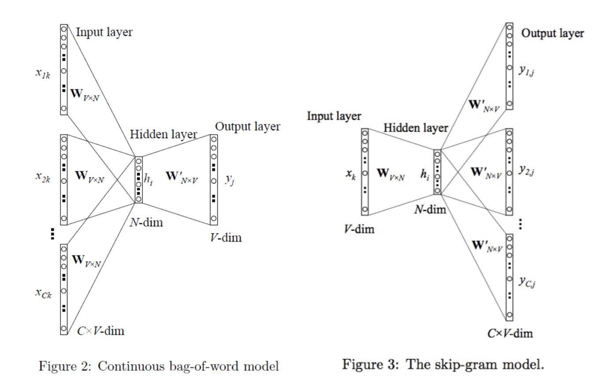
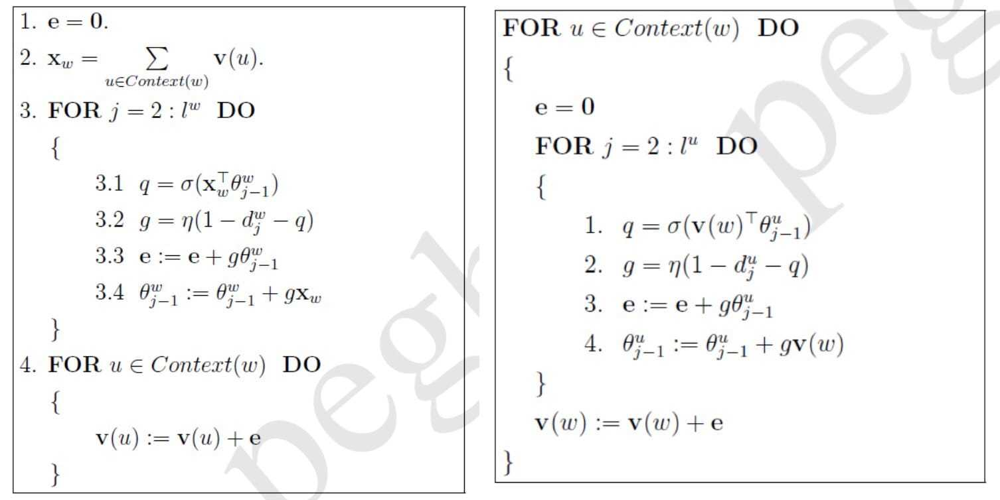
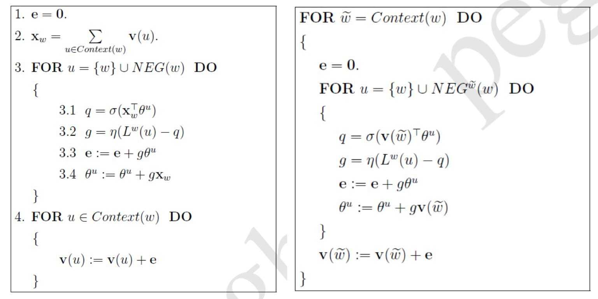
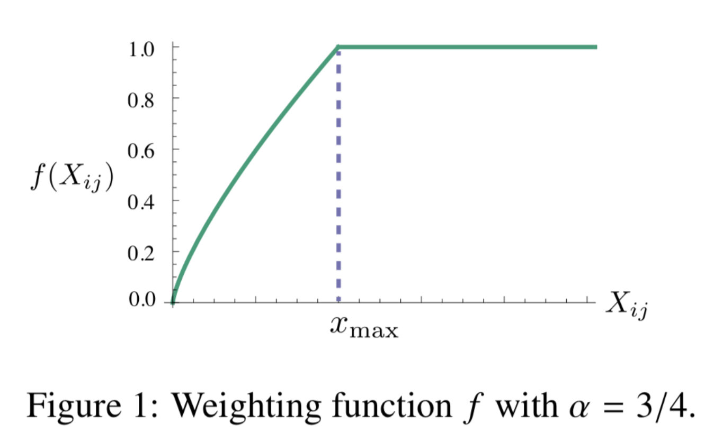
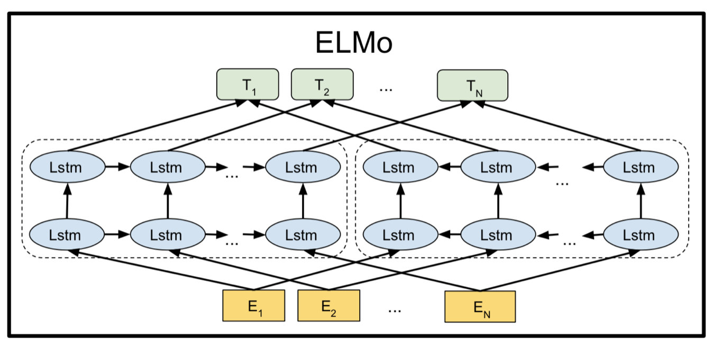
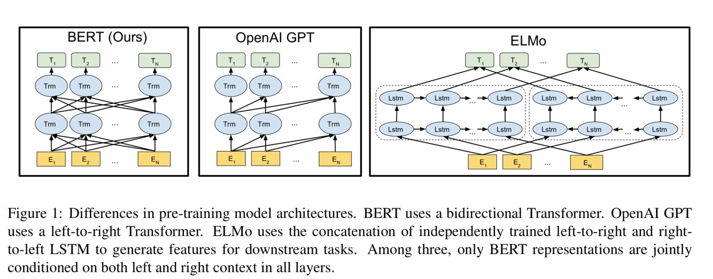
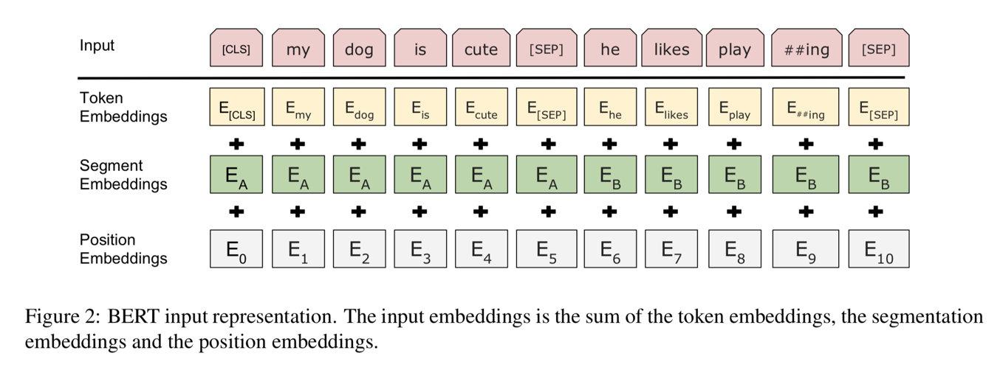

# 1. 缘起

在自然语言处理任务中为什么不直接使用单词，而是要使用词向量来替代？这是因为在计算机中，尤其是神经网络中，只能处理数字类型的数据。而单词这一主体可以视为没有大小关系的类别，所以用机器学习里面处理类别标签的方法就要把单词表示成为一个向量，方便模型处理。

所以在计算机的眼中，单词并不是我们理解中的单词，单词只是一个向量的表示。所以词向量的发展历程其实可以视为是一个让计算机像人一样看待单词的过程。词向量越来越能代表单词在现实世界中的意义，仿佛远古时候，人使用的单词一开始并没有什么复杂的意思，各个单词之间的含义也比较独立。慢慢地，人类的知识发展赋予单词以更复杂的意义，单词之间也形成了错综复杂的关系。

而词向量最终的目标应该就是要达到这样的目标：**计算机看到这个词向量就像人看到这个单词一样，人类所赋予单词的种种复杂意义也被计算机赋予给了词向量**。

# 2. 独热表示

我们首先假设我们的世界中存在$V$个单词，每个单被赋予了唯一的一个编号。那么独热编码就是对词库中的第$i$个单词，用一个$V$维的向量来表示，其中第$i$个位置为1，其他位置均为0：
$$
word_i = [0, 0, ..., 0, 0, 1, 0, 0, ..., 0]_V
$$
这样的一个词向量就被输入到模型中来代表一个单词，模型就只需要对词向量进行数学处理即可，而不用顾及复杂的形式——单词了。这样的词向量对于模型来说具有一些单词所不具有的优点：

- **便于处理**：单词这样的离散特征被影射到了欧氏空间中，变成了连续特征。这样，不仅可以处理类别型的数据——单词，也可以用数学方法计算相似度与距离。
- **无序类别**：相比于直接用数字表示，独热编码的向量之间是无序的，也符合单词本身的特点。

但是独热编码存在很严重的问题，主要是有以下一些缺点：

- **孤岛单词**：每个词向量之间的距离是相同的，这和实际中的单词分布是及其不相似的。现实中的有些单词与单词之间意义很相近，而有些单词与单词之间意义相差比较大，而独热编码的每一个词向量之间的距离都是相同的。因此，我们无法用词向量之间的相似以及距离信息来衡量单词之间的相似程度。
- **表示稀疏**：这种表示十分稀疏，因为在每一个词向量中，只有一个维度的值为1，而其他所有维度的值都为0。因此存储效率非常低。
- **维度爆炸**：我们都知道，现实世界中的单词数量是巨大的，因此独热编码的维度会非常大。这样，计算机处理起来会十分麻烦。

# 3. 静态分布式表示

针对独热编码的缺点，后来发展出了分布式表示的词向量。所谓分布式，就是将独热编码压缩成一个一定长度的向量，向量的每个维度上用实数而不是0或1表示。这样，词向量的维度大小就不依赖于语料库中单词的数量了。而且，词向量变得密集了，增加了存储效率。

我们会希望这样密集表示的词向量具有一些单词本身的特点。最重要的是：**可以用词向量之间的距离来衡量单词之间的相似程度**。等于是将单词的语义信息编码到了词向量中。至于静态则是为了和下一节的动态区分，这里暂时先不说明。

那么如何得到这样的分布式词向量表示呢？或者说如何才能保证这样的分布式词向量可以将语义编码进去？这就说到了著名的分布式假设：**相似的单词总是出现在相似的上下文中**。这样，我们就可以根据单词出现在上下文中的频率来得到单词的分布式表示了。这里介绍几种主流的方法，主体思想为基于单词词频和基于单词预测。

## 3.1 LSA

分布式表示的理论基础就是分布式假设，总体方向就是根据单词共同出现的信息来生成词向量。最简单的表达单词共现信息的方法就是单词共现矩阵$X$，这是一个$V$维的方阵，元素$X_{i, j}$代表的含义是$word_i$和$word_j$在特定大小的上下文窗口中出现的次数。还有一种方法是计算词-文档矩阵$Y_{V, D}$，元素$Y_{i, j}$代表的含义是$word_i$在$doc_j$中出现的次数。

### **原始共现表示**

最简单的表示单词的分布式词向量就是用共现矩阵 $X$的第$i$行或者第$i$列表示单词$word_i$。这样的表示是分布式的，但是维度还是很大，并且还是比较稀疏的。对于$Y_{V, D}$也是类似的操作。

### **SVD奇异值分解**

奇异值分解是数学中对矩阵的一种分解操作。假设矩阵$M_{m,n}$，那么可以做这样的分解：$M_{m,n}=U_{m,m} \Sigma_{m,n} V^{T}_{n,n}$。其中$U, V$均为酉矩阵，$\sum$为非负实对角矩阵，$\sum$对角线上的元素称为$M$的奇异值。

对于共现矩阵$X$，我们可以做奇异值分解，然后用前$d$大的奇异值来代替所有的奇异值，可以得到： 
$$
X_{V * V} \approx U_{V * d} \Sigma_{d * d} V_{d * V}^{T}
$$
这样$U$就是词向量矩阵的一个低维表示，通过奇异值分解，相当于对原始共现矩阵进行了降噪，丢掉了一些不重要的信息。但是有一个很大的缺点就是计算量太大。

## 3.2 Word2Vec

Word2Vec是基于神经网络的预测模型，总体而言就是利用上下文中的单词来预测中心词或者通过中心词来预测上下文中的单词。

### CBOW

CBOW（Continuous Bag of words）是利用上下文的单词来预测中心词，首先规定一个上下文窗口，先得到上下文单词的词向量，简单相加就可以视作上下文的表示。然后把这个上下文表示经过一个$softmax$层来预测中心词。

### Skip-Gram

Skip-Gram刚好相反，是利用中心词来预测上下文中的所有单词。两种方法具体图示如下图：

‌

### Hierarchical Softmax

如果直接利用$softmax$来计算的话，计算量会非常大，所以论文里采用了层级$softmax$来进行输出层的优化。用$w$表示中心词，$\sum u_i$表示上下文中的单词，用$x_w$表示。

- 首先将所有单词根据词频组织成一个Huffman树，这样，越经常出现的单词路径越短，查询效率越高。每个内部节点维护一个$d$维的参数，叶子结点就是单词的词向量表示，这样，每一个单词就有了一个唯一的路径。
- 这样，预测单词其实就变成了最大化正确路径的概率。可以通过内部节点参数与我们得到的向量进行内积然后转换为概率来决定是向左走还是向右走。
- 对于CBOW，相当于用$x_w$来预测$w$，训练时更新$u_i$的参数（词向量表示）。对于Skip-Gram，相当于用$w$来预测$u_i$，训练时更新$w$的词向量表示。

* 上图是根据Hierarchical Softmax来训练CBOW（左）和Skip-Gram（右）的伪代码。总体上都是利用输入来预测输出，然后更新输入和参数。不同的是在CBOW和Skip-Gram中输入分别为上下文和中心词。训练一次Skip-Gram更新2c次中心词，而CBOW更新一次上下文（2c个单词）。

### Negative Sampling

负采样的思想更为简单，对于中心词$w$，可以视为$(w, C(w)$的一个正例，针对中心词负采样$NEG$个负例$NEG(w)$可以组成共$NEG+1$个样本$(w | NEG(w), C(w))$，然后做LR分类就可以了。

- 对于CBOW，样例为$(w | NEG(w), C(w))$，然后更新上下文$C(w)$中的单词$u_i$，更新一次。
- 对于Skip-Gram，样例为$(w | NEG(w), u_i)$，在这里，负采样的单词对每一个$u_i$都是公用的。相当于对一组采样要做$2c$词回归预测，更新$u_i$，更新2c次。
- 负采样更新的频度更高，所以一般相对于CBOW收敛的更快，但是精确度上要差一些。

* 上图为利用Negative Sampling来实现CBOW（左）和Skip-Gram（右）的伪代码。代码实现中两种算法基本一样，都是针对中心词$w$采样负例$NEG(w)$，然后把上下文作为输入来预测中心词。不同的是CBOW把上下文作为一个整体，训练一次（NEG+1个样例），更新一次，但更新2c个上下文单词。而Skip-Gram则把上下文视为一个个单独的单词，来预测2c次中心词，更新频率高。另外，对偶的中心词$w$和采样的负例表示是参数$\theta ^ u$的表示，但一般不能作为单词的更新。

具体的损失函数推导可见：[word2vec中的数学原理](https://www.cnblogs.com/peghoty/p/3857839.html)

## 3.3 GloVe

GloVe是斯坦福NLP组2014年发表在EMNLP上的一篇文章。这篇文章基于单词之间的**共现矩阵**来得出单词的分布式表示的。总体的思想就是：如果两个单词越多的出现在同一上下文中，那么这两个单词就越相似。

### 如何训练

- 根据语料库计算共现矩阵$X_{V, V}$，其中元素$X_{i, j}$代表的含义是$word_i$和$word_j$在特定大小的上下文窗口中出现的次数。而论文中的次数并不是以1为单位的，定义了一个衰减系数，两个单词距离越远，那么出现的次数权重就会衰减的越多。
- 构建共现矩阵与词向量之间的关系。从直观的角度来看，两个单词越相近，词向量就越相似，共现次数就会越大。那么基于这一点，论文构建了一个词向量与共现矩阵之间的关系。$w_i$和$\tilde{w}_{j}$表示单词词向量，也是我们最终要求解的词向量，$b_i$和$\tilde{b}_{j}$则是偏移量。

$$
{w}_{i}^{T} \tilde{w}_{j}+b_{i}+\tilde{b}_{j}=\log \left(X_{i j}\right)
$$

- 如何推导上式：

  - 假设我们要研究单词$i$和单词$j$分别为$ice$和$cream$，$P_{ik},P_{jk}$分别表示单词$k$出现在单词$j$和单词$j$上下文中的概率。通过观察共现矩阵，可以看出
    - 对于和$ice$有关但是和$cream$无关的$k$，$P_{i k} / P_{j k}$会非常大；
    - 对于和$ice$无关但是和$cream$有关的$k$， $P_{i k} / P_{j k}$；
    - 对于和$ice$与$cream$都有关或者都无关的$k$， $P_{i k} / P_{j k}$
    - 所以比率$P_{i k} / P_{j k}$可以很好的区分单词。
  - 因此我们可以用函数$F\left(\left(w_{i}-w_{j}\right)^{T} \tilde{w}_{k}\right)=\frac{P_{i k}}{P_{j k}}$来表示这个关系，用$w_{i}-w_{j}$是因为我们只关心他们之间的区别。
  - 接下来可以把公式转换为$F\left(\left(w_{i}-w_{j}\right)^{T} \tilde{w}_{k}\right)=\frac{F\left(w_{i}^{T} \tilde{w}_{k}\right)}{F\left(w_{j}^{T} \tilde{w}_{k}\right)}$，可以观察出来函数$F$其实是一个指数函数。其中一个解为$w_{i}^{T} \tilde{w}_{k}=\log \left(P_{i k}\right)=\log \left(X_{i k}\right)-\log \left(X_{i}\right)$，为了保证对称性，我们要加上偏置得到$w_{i}^{T} \tilde{w}_{k}+b_{i}+\tilde{b}_{k}=\log \left(X_{i k}\right)$作为最后的公式。 

- 接下来就是构建训练的损失函数了。这里用的就是类似于基本的均方损失函数，但是基于基本的均方损失函数，这里针对$X_{i, j}$又加了一个系数$f(X_{i, j})$。满足如果$$X_{i, j}$$越大，那么重要性就越大，所以系数也就越大。
  $$
  J=\sum_{i, j=1}^{V} f\left(X_{i j}\right)\left(w_{i}^{T} \tilde{w}_{j}+b_{i}+\tilde{b}_{j}-\log X_{i j}\right)^{2}
  $$

  $$
  f(x)=\left\{\begin{array}{cc}{\left(x / x_{\max }\right)^{\alpha}} & {\text { if } x<x_{\max }} \\ {1} & {\text { otherwise }}\end{array}\right.
  $$

- 接下来就是根据等式和损失函数进行训练了。在共现矩阵中随机采样不为0的$X_{i, j}$进行训练，利用梯度下降法进行训练。因为$X_{i, j}$是对称的，所以学习到的$w_i$和$\tilde{w}_{j}$也是对称的。因为初始化不同，所以二者的值会不同。为了提高鲁棒性，把两个向量相加得到最终的词向量。

### 优点

- 充分利用了语料库的信息，并且不用对大矩阵进行矩阵分解，降低了计算代价。
- GloVe相当于结合了矩阵分解和Word2Vec的优点。

# 4. 动态分布式表示

第三部分讲的Word2Vec和GloVe已经得到了很好的分布式词向量表示，但是还有以下几个明显的缺点。

- 词向量的生成严重依赖于训练的词库，因为训练出的单词的语义是唯一的，所以会偏向训练语料库中的语义。对于不同任务不能很好的区分。
- 词向量是唯一的，这表示不能很好地处理一词多义的问题。

因此，针对以上缺点，就有了动态词向量的思想。动态词向量的主题思想是通过上下文来确定单词的一词多义到底是哪一个意思，下面介绍比较有影响力的几种方法。

## 4.1 ELMo

ELMo通过巨大的无监督语料库来训练语言模型，但是并不是仅仅使用最后的hidden state作为单词表示。而是把整个预训练的网络嵌入到具体模型中，这样就可以根据具体上下为来生成动态的词向量了。

### 如何预训练

ELMo的预训练网络结构如下所示：

‌

如上图所示，网络结构是一个简单的两层双向LSTM网络，分别通过上文和下文去预测单词，最大化预测概率，会得到相应的语言模型。输入 EiEi是通过字符卷积预先训练好的初始词向量，这样其实对一个单词会得到三个不同的Embedding表示，每一层的Embedding加上初始的$E_i$。

对于$token_k$，$L$层的双向LSTM最后可以得到$2L+1$个词向量表示：
$$
\begin{aligned} R_{k} &=\left\{\mathbf{x}_{k}^{L M}, \overrightarrow{\mathbf{h}}_{k, j}^{L M}, \widetilde{\mathbf{h}}_{k, j}^{L M} | j=1, \ldots, L\right\} =\left\{\mathbf{h}_{k, j}^{L M} | j=0, \ldots, L\right\} \end{aligned}
$$
对于特定的任务，我们可以计算一个特定的词向量表示：
$$
\mathbf{E} \mathbf{L} \mathbf{M} \mathbf{o}_{k}^{\operatorname{task}}=E\left(R_{k} ; \Theta^{\operatorname{task}}\right)=\gamma^{\operatorname{task}} \sum_{j=0}^{L} s_{j}^{\operatorname{task}} \mathbf{h}_{k, j}^{L M}
$$
$\mathbf{s}^{\operatorname{task}}$是对不同角度词向量取的权重，$\gamma^{\text {task}}$表示对整体词向量的缩放。

### 如何使用

- 最简单的使用方法就是将预训练好的词向量给予一定的权重，然后将ELMo词向量与原始的词向量(字符卷积)拼接作为Embedding层使用，在训练中更新权重。
- 还可以在输出层处也加入这样的一个向量，但是权重要重新训练，不能做成一样的。
- 也可以在ELMo模型中加入dropout, 以及采用 L2 loss的方法来提升模型。并且，这里的 L2 项的系数$\lambda$越大, 越有取各层平均值的意思，越小，越可以发挥各个层之间的不同带来的效果。 但是并不是说越小越好。

### 缺点

- LSTM的抽取能力可能会稍微弱一些。
- 这里的双向其实并不是实际意义上的双向，不过还没有严格意义上的论证哪个会更强。

## 4.2 GPT

ELMo相当于是提供了一个特征(词向量)抽取的方法，而GPT更多的是利用了迁移学习的思想。并且利用Transformer来替代LSTM，可以抽取更长距离的语言结构。然后再具体任务上进行微调来适应特定的任务。

### 如何预训练

GPT采用的是单向Transformer来用上文预测中心词。相当于BERT中逐步做完形填空。

### 如何使用

使用方法和BERT是类似的，直接利用整个网络的输出层来连接，对于不同的任务，具体使用方法如下图：

## 4.3 BERT

在BERT出现之前，Word2Vec在单词级别上完成了预训练，但是由于单词只是文本的一个组成部分，并未能解决一词多义的情况。对于一个单词，不会结合上下文去看，只会把单词视为一个主体。而随后出现的ELMO - Embedding from Language Models，ELMO解决一词多义的思想是：先训练一个静态的词向量，然后根据具体任务的上下文提取网络中的Embedding与静态词向量进行融合，这样就编码了上下文的信息。ELMO主要的缺点在于特征抽取器使用的是传统的LSTM，而不是Transformer，这样就限制了抽取能力。还有一点是融合上下文ELMO采取的方法是拼接上文和下文编码。而GPT（Generative Pre-Training）则是更接近于图像领域的预训练，但是其采用的是单向模型。

**BERT**- Bidirectional Encoder Representations from Transformers集前作之大成，为自然语言处理任务构造了一个句子级别的特征抽取器。通过大规模无监督语料库训练出了句子的表征，可以作为其他任务的特征抽取器。

‌

### 训练任务

BERT怎么才能学习使模型学习到上下文的信息呢，论文构造了两个训练任务：

- **Mask Language Model(MLM)**：通过做一个类似于完形填空的题目，来使单词可以学习上下文的信息。
  - 在句子中选定15%的单词随机MASK。MASK的方式有：80% -> [mask], 10% -> [random other word], 10% -> [keep original]。
  - 每次只预测被MASK的那些单词，因此模型会收敛得慢一些。
- **Next Sentence Prediction(NSP)**：通过预测下一个句子，使得句子可以学习到更丰富的文本间关系。
  - 在处理输入的时候把两个句子打包成一个序列，中间用分隔符分开。
  - 在选取句子对时，以50%的概率选择下一句话，以50%的概率随机选择一句话。正反例比率为1:1。

### 数据输入

数据在输入的时候首先被组织成Embedding格式，具体如下图所示：

- 使用WordPiece词向量作为初始的词向量。
- 位置向量使用$sin$和$cos$函数生成。
- 每一个序列的第一个位置是[CLS]标志，表示序列的起始位置。最终句子的表征向量也是使用这个位置的词向量表示。
- 两个句子的输入被打包成一个序列，中间用[SEP]分隔。在每个词向量上再加上整个句子的词向量表示，一个句子的输入只加上这一个句子的向量。

### 如何使用

- **句子匹配任务**：对于此类判断两个句子之间关系的任务，只需像预训练NSP时一样组织输入序列即可，利用网络输出的[CLS]位置上的向量C当作两个句子关系的表示，接一个全连接层转换成K维的向量，连接softmax做分类任务就可。
- **句子分类任务**：对于文本分类任务，像预训练任务MLM一样组织输入，使用[CLS]位置上的向量作为整个句子的表示，接全连接层和softmax做分类任务即可。
- **阅读理解任务**：对于阅读理解任务，利用Question和Paragraph来预测Answer。将Question(A)和Paragraph(B)打包作为输入序列。在finetune时需要新训练的参数为起始向量S和结束向量E。使用Paragraph里最后一层的Token的输出向量作为Token的表示，分别与S和E做匹配，最大化起始和结束位置概率即可。
- **序列标注任务**：对于序列标注任务，利用最后一层的每个位置的输入当作对应Token的表示，将其接入一个全连接层，再用Softmax分类成标注类别。
- **文本生成任务**：在文中未提及类似于机器翻译这种文本生成的任务，可以尝试利用文中的结构作为Encoder来编码源语句，再使用一个Decoder来生成目标语句。

### 创新意义与不足

创新之处在于：

- 在双向语言模型的训练中，采取Transformer结构直接从双向上下文构建单词表征，而不是类RNN结构中将上文表征与下文表征拼接起来当作上下文的表征。但是这种方法相比于拼接起来的方法孰优孰劣还未有详细的论文说明。
- 预训练的网络主要是做句子表征，在finetune时会根据具体的任务在接一个需要重新训练的网络，利用预训练的特征。
- 将巨大的无监督自然语言语料库的先验知识预训练进了网络里，对具体任务是一个极大的补充。

存在的缺点有：

- 在MLM任务中，使用MASK(80%)遮盖要预测的单词，但是在具体任务中并不会有MASK这个Token。另外有10%会随机替换成其他单词，这会迫使句子学习到分布式表征，但是也还是会带来一定量的扰动(10% * 15%)。
- 在MLM任务中，每次只预测15%的单词，使得模型收敛速度比较慢。

# 5. 发展前景

目前的词向量已经由最初的独热表示发展到了动态词向量表示，解决了一词多义以及维度爆炸等问题。主体的发展方向是通过整个上下文来构建单词的动态表示，目前对词向量的生成做到了句子层面的表示，而且针对简单的一些自然语言处理任务也有了相应的使用方法。

但是，回到我们初始的期望，我们最终的目标是能让计算机看到词向量就像人看到单词一样。其实人在脑中储存了大量的先验知识，并且有一种方法可以不断去增强这种先验知识。目前构建词向量表示的方法更多地是去构建一种通用的语言模型，而人在做自然语言处理任务时，我觉得更多的是一种复合模型，可以理解为脑海中有大量的思维结构，每遇到一个问题，我们会搜索到相应的思维结构进行探索。然后利用这种思维结构结合先验知识来完成任务。

所以未来的发展方向我觉得会是更多的复合模型，而不是致力于去构建一种万能的语言模型。因为我们可以感觉到，虽然类似于BERT这种通用的模型，它阅读到了远远超过人类的语言文本，但是在做很多任务时还是远远不如人类的。所以如果可以针对大量的任务，构建相应的网络结构(思维结构)，并且这些结构相互之间是有联系的。然后有一种网络结构搜索的手段，针对特定任务去选择对应的结构来解决问题。我觉得这样可能更符合人的思维方式。

‌

# 6. 参考资料

1. [GloVe: Global Vectors for Word Representation](https://www.aclweb.org/anthology/D14-1162)
2. [Glove详解](http://www.fanyeong.com/2018/02/19/glove-in-detail/)
3. [NLP 笔记 - 再谈词向量](http://www.shuang0420.com/2017/03/21/NLP 笔记 - 再谈词向量/)
4. [GloVe算法原理及简单使用](https://zhuanlan.zhihu.com/p/50946044)
5. [ELMo: Deep contextualized word representations](https://allennlp.org/elmo)
6. [一文通览词向量](https://zhuanlan.zhihu.com/p/34630357)
7. [ELMo原理解析及简单上手使用](https://zhuanlan.zhihu.com/p/51679783)
8. [[论文笔记\]ELMo](https://zhuanlan.zhihu.com/p/37684922)
9. [BERT: Pre-training of Deep Bidirectional Transformers for Language Understanding](https://arxiv.org/pdf/1810.04805.pdf?fbclid=IwAR3FQiWQzP7stmPWZ4kzrGmiUaN81UpiNeq4GWthrxmwgX0B9f1CvuXJC2E)
10. [从Word Embedding到Bert模型—自然语言处理中的预训练技术发展史](https://zhuanlan.zhihu.com/p/49271699)
11. [BERT详解](https://zhuanlan.zhihu.com/p/48612853)
12. [GPT: Improving Language Understanding by Generative Pre-Training](https://www.cs.ubc.ca/~amuham01/LING530/papers/radford2018improving.pdf)

